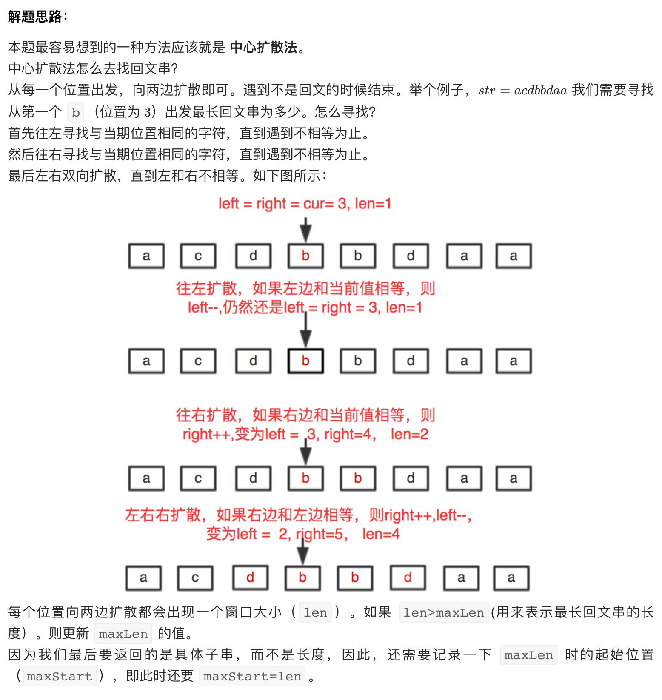

## 5. Longest Palindromic Substring

---



```java
class Solution {
    public String longestPalindrome(String s) {
        int strlen = s.length();
        int maxLen = 0;
        int maxBegin = 0;
        int left = 0;
        int right = 0;
        int len = 1;
        for (int i = 0; i < strlen; i++) {
            left = i - 1;
            right = i + 1;
            while (left >= 0 && s.charAt(left) == s.charAt(i)) {
                left--;
                len++;
            }
            while (right < strlen && s.charAt(right) == s.charAt(i)) {
                right++;
                len++;
            }        
            while (left >= 0 && right < strlen && 
                   s.charAt(left) == s.charAt(right)) {
                left--;
                right++;
                len += 2;
            }
            if (len > maxLen) {
                maxLen = len;
                maxBegin = left;
            }
            len = 1;
        }
        return s.substring(maxBegin + 1, maxBegin + maxLen + 1);
    }
}
```