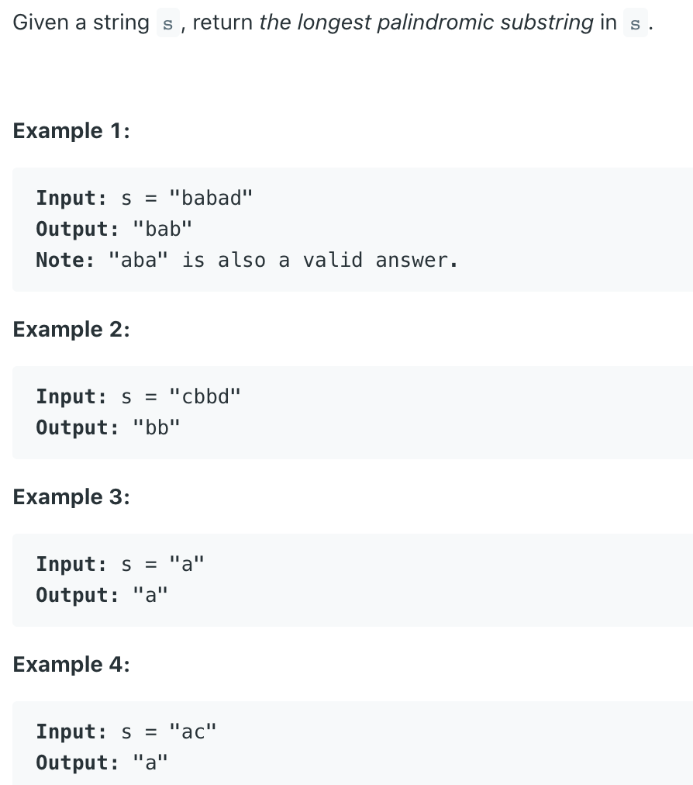

## 5. Longest Palindromic Substring



```ruby
assume i = 3

    0  1  2  3  4  5  6  7
   [a  c  d  b  b  d  a  a]
             l
             r

    0  1  2  3  4  5  6  7
   [a  c  d  b  b  d  a  a]
          l
                   r

    0  1  2  3  4  5  6  7
   [a  c  d  b  b  d  a  a]
       l
                      r

right - left - 1 = 6 - 1 - 1 = 4, # dbbd => len = 4
lo = left + 1 # since we need to put lo back to begin of palindrome
```


```java
public class LongestPalindromicSubstring {
    private int lo, maxLen;

    public String longestPalindrome(String s) {
        if (s.length() < 2)
            return s;

        int left = 0, right = 0;

        for (int i = 0; i < s.length(); i++) {
            char c = s.charAt(i);
            left = i;
            right = i;

            while (left >= 0 && s.charAt(left) == c) {
                left--;
            }
            while (right < s.length() && s.charAt(right) == c) {
                right++;
            }
            while (left >= 0 && right < s.length() 
                        && s.charAt(left) == s.charAt(right)) {
                left--;
                right++;
            }
            if (maxLen < right - left - 1) {
                lo = left + 1;
                maxLen = right - left - 1;
            }
        }
        return s.substring(lo, lo + maxLen);
    }

    public static void main(String[] args) {
        LongestPalindromicSubstring lps = new LongestPalindromicSubstring();
        String str = lps.longestPalindrome("acdbbdaa");
        System.out.println(str); // dbbd
    }
}
```