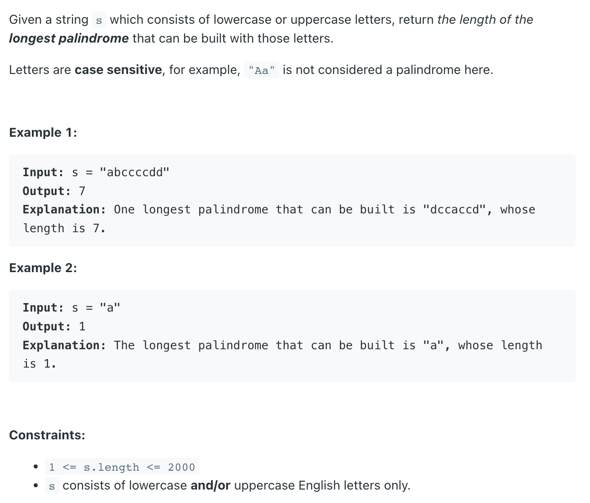
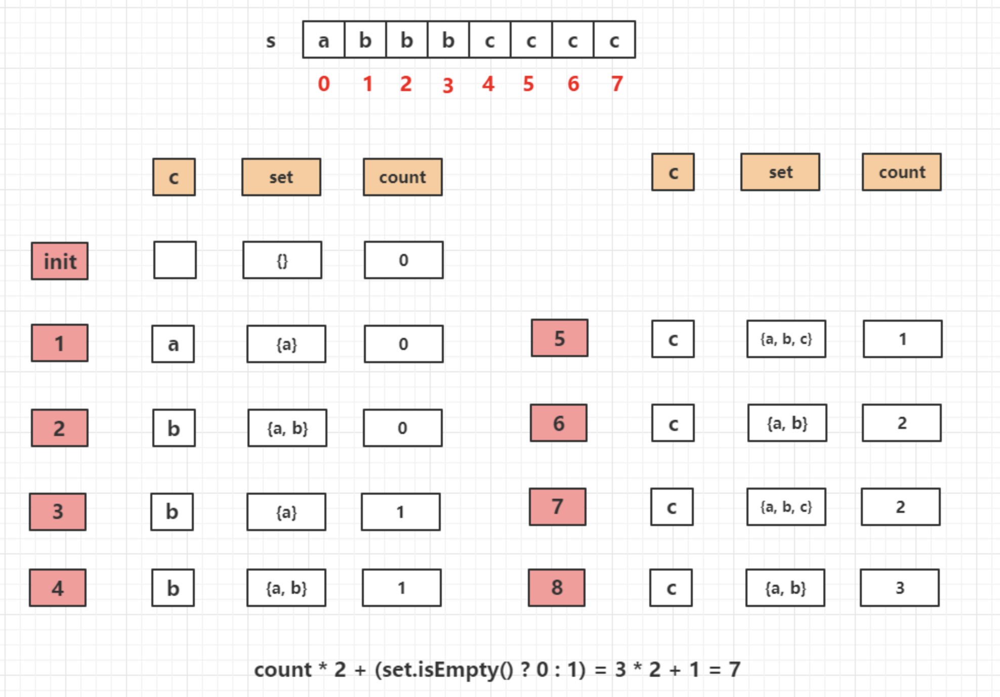

## 409. Longest Palindrome


- 注意题目的意思：题目是说**可以组成**palindrome 的最长回文串， 也就是说文的是字母组合.
  - 所以就如果不是成对出现的，剩下来的就都没有意义，都可以当成任意一个字符。



```java
class _409_LongestPalindrome {
    public int longestPalindrome(String s) {
        if (s == null || s.length() == 0) return 0;

        Set<Character> set = new HashSet<>();
        int count = 0;
        for (int i = 0; i < s.length(); i++) {
            char c = s.charAt(i);
            if (set.contains(c)) {
                set.remove(c);
                count++;
            } else {
                set.add(c);
            }
        }

        return count * 2 + (set.isEmpty() ? 0 : 1);
    }
}
```
