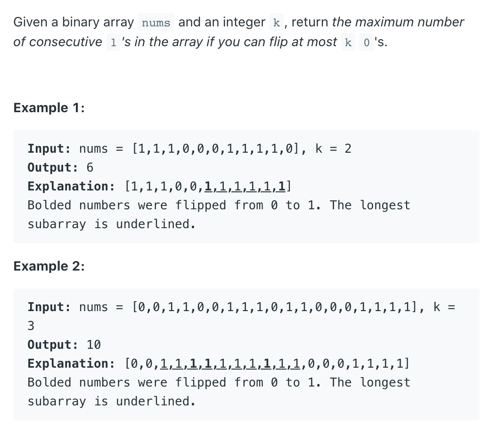

## 1004. Max Consecutive Ones III



```java
/*

initialize: slow = fast = 0
zeros = 0, longest = 0

1  1  1  0  0  0  1  1  1  1  0
s
      f
# longest = 3,  zeros = 0 


1  1  1  0  0  0  1  1  1  1  0
s
            f
# longest = 5,  zeros = 2    


1  1  1  0  0  0  1  1  1  1  0
s
               f
# longest = 5,  zeros = 3


1  1  1  0  0  0  1  1  1  1  0
            s
               f
# longest = 5,  zeros = 2


1  1  1  0  0  0  1  1  1  1  0
            s
                           f
# longest = 6,  zeros = 2


1  1  1  0  0  0  1  1  1  1  0
            s
                              f
# longest = 6,  zeros = 3


1  1  1  0  0  0  1  1  1  1  0
               s
                                f
# longest = 6,  zeros = 2


*/
class Solution {
    public int longestOnes(int[] nums, int k) {
        int slow = 0;
        int fast = 0;
        int zeros = 0;
        int longest = 0;
        while (fast < nums.length) {
            if (nums[fast] == 0) {
                zeros++;
            }
            while (zeros > k) {
                if (nums[slow] == 0) {
                    zeros--;
                }
                slow++;
            }
            longest = Math.max(longest, fast - slow + 1);
            fast++;
        }
        return longest;
    }
}
```