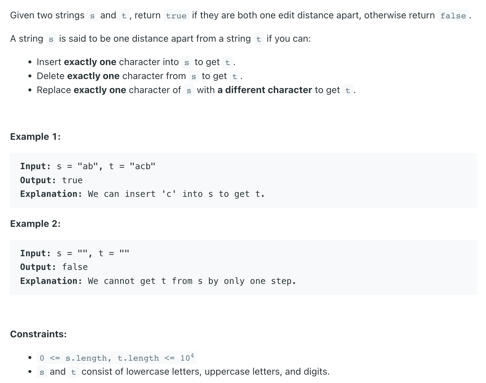

## 161. One Edit Distance

---

```java
/*
   There're 3 possibilities to satisfy one edit distance apart:

    1) Replace 1 char:
          s: a B c
          t: a D c
    2) Delete 1 char from s:
          s: a D  b c
          t: a    b c
    3) Delete 1 char from t
          s: a   b c
          t: a D b c

 */
class _161_OneEditDistance {
    public boolean isOneEditDistance(String s, String t) {
        for (int i = 0; i < Math.min(s.length(), t.length()); i++) {
            if (s.charAt(i) != t.charAt(i)) {
                // s has the same length as t, so the only possibility is replacing one char in s and t
                if (s.length() == t.length()) {
                    // cause every case is that it just needs to alter exactly one character
                    return s.substring(i + 1).equals(t.substring(i + 1));
                } else if (s.length() < t.length()) {
                    // t is longer than s, so the only possibility is deleting one char from t
                    return s.substring(i).equals(t.substring(i + 1));
                } else {
                    return s.substring(i + 1).equals(t.substring(i));
                }
            }
        }

        //All previous chars are the same,
        // the only possibility is deleting the end char in the longer one of s and t
        return Math.abs(s.length() - t.length()) == 1;
    }
}
```