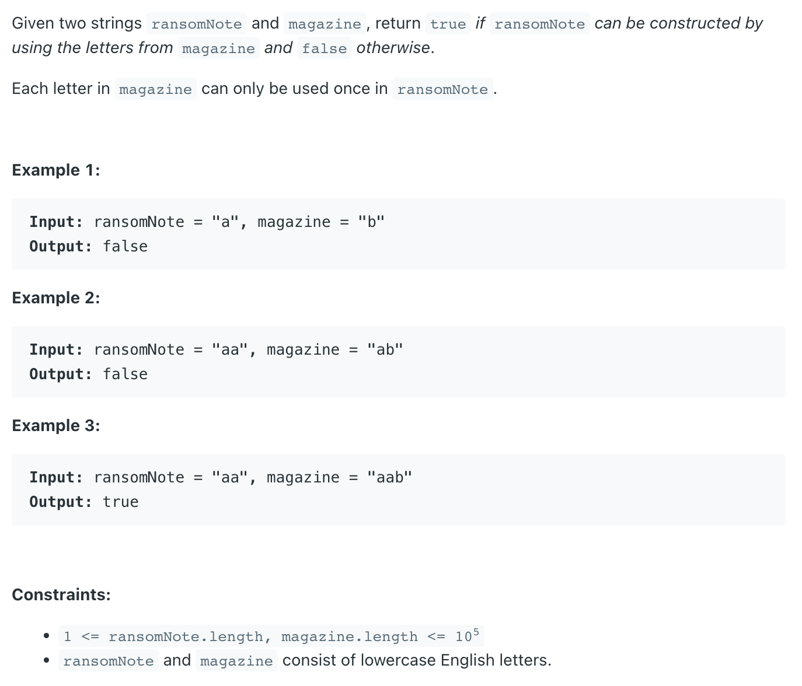

## 383. Ransom Note

---

### HashMap

```java
class Solution {
    public boolean canConstruct(String ransomNote, String magazine) {
        int len1 = ransomNote.length(), len2 = magazine.length();
        if (len1 > len2) return false;
        
        
        Map<Character, Integer> m1 = new HashMap<>();
        Map<Character, Integer> m2 = new HashMap<>();        
        
        for (Character c : ransomNote.toCharArray()) {
            m1.put(c, m1.getOrDefault(c, 0) + 1);
        }
        
        for (Character c : magazine.toCharArray()) {
            m2.put(c, m2.getOrDefault(c, 0) + 1);
        }
        
        for (Character key : m1.keySet()) {
            if (!m2.containsKey(key)) {
                return false;
            }
            if (m2.containsKey(key)) {
                if (m2.get(key) < m1.get(key)) {
                    return false;
                }
            }
        }
        return true;
    }
}
```
---

### Array

```java
class ransomNote_array {
    public boolean canConstruct(String ransomNote, String magazine) {
        int len1 = ransomNote.length(), len2 = magazine.length();
        if (len1 > len2) return false;

        int[] freq = new int[26];
        for (Character c : ransomNote.toCharArray()) {
            freq[c - 'a']++;
        }

        for (Character c : magazine.toCharArray()) {
            freq[c - 'a']--;
        }

        for (int i : freq) {
            if (i > 0) {
                return false;
            }
        }
        return true;
    }
}
```

---

- 最极致的写法：

```java
class ransomNote {
    public boolean canConstruct(String ransomNote, String magazine) {
        int[] freq = new int[26];
        for (Character c : magazine.toCharArray()) {
            freq[c - 'a']++;
        }

        for (Character c : ransomNote.toCharArray()) {
            if (--freq[c - 'a'] < 0) {
                return false;
            }
        }
        return true;
    }
}
```

