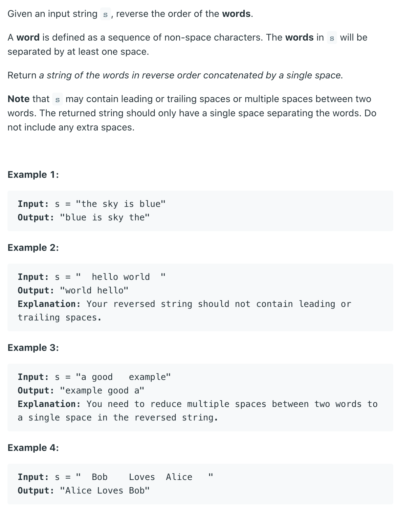

## 151. Reverse Words in a String



- 具体分析见： Remove Spaces && Reverse Words in a String II

---

```java
class Solution {
    public String reverseWords(String s) {
        if (s == null || s.length() == 0) {
            return s;
        }
        String cleanStr = removeBeginEndSpace(s);
        char[] arr = cleanStr.toCharArray();
        int left = 0; 
        int right = arr.length - 1;
        
        //reverse the whole sentence
        reverse(arr, left, right);
        
        int start = 0;
        for (int i = 0; i < arr.length; i++) {
            if (arr[i] != ' ' && (i == 0 || arr[i - 1] == ' ')) {
                start = i;
            }
            if (arr[i] != ' ' && (i == right || arr[i+1] == ' ')) {
                //reverse every word
                reverse(arr, start, i); 
            }
        }
        return new String(arr);
        
    }
    
    // remove the leading, tailing space, duplicate space
    private String removeBeginEndSpace(String str) {
        char[] arr = str.toCharArray();
        int slow = 0;
        for(int fast = 0; fast < arr.length; fast++){
            if(arr[fast] == ' ' && (fast == 0 || arr[fast - 1] == ' ')){
                continue;
            }
            arr[slow++] = arr[fast];
        }
        if(slow > 0 && arr[slow - 1] == ' '){
            slow--;
        }        
        return new String(arr, 0, slow);
    }
    
    private void reverse(char[] arr, int left, int right){
        while (left < right) {
            char tmp = arr[left];
            arr[left] = arr[right];
            arr[right] = tmp;
            left++;
            right--;
        }
    }
}
```