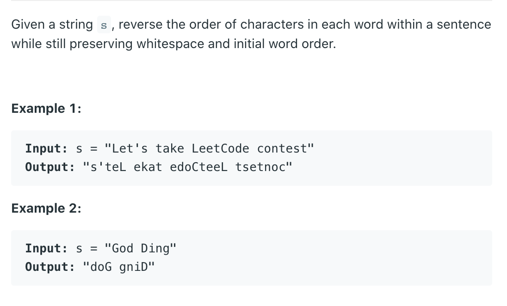

## 557. Reverse Words in a String III




## 具体分析看下面链接：

- [Reverse Words in a String II](https://novemberfall.github.io/LeetCode-Algorithm/m8/reverseWord.html)


```java
class Solution {
    public String reverseWords(String s) {
        if(s == null || s.length() == 0){
            return s;
        }
        
        char[] array = s.toCharArray();
        int startIndex = 0;
        for(int i = 0; i < array.length; i++){
            if(array[i] != ' ' && (i == 0 || array[i - 1] == ' ')){
                startIndex = i;
            }
            if(array[i] != ' ' && (i == array.length - 1 || array[i + 1] == ' ')){
                reverse(array, startIndex, i);
            }
        }
        return new String(array);
    }
    
    private void reverse(char[] res, int left, int right){
        while(left <= right){
            char temp = res[left];
            res[left] = res[right];
            res[right] = temp;
            left++;
            right--;
        }
    }
    
}
```