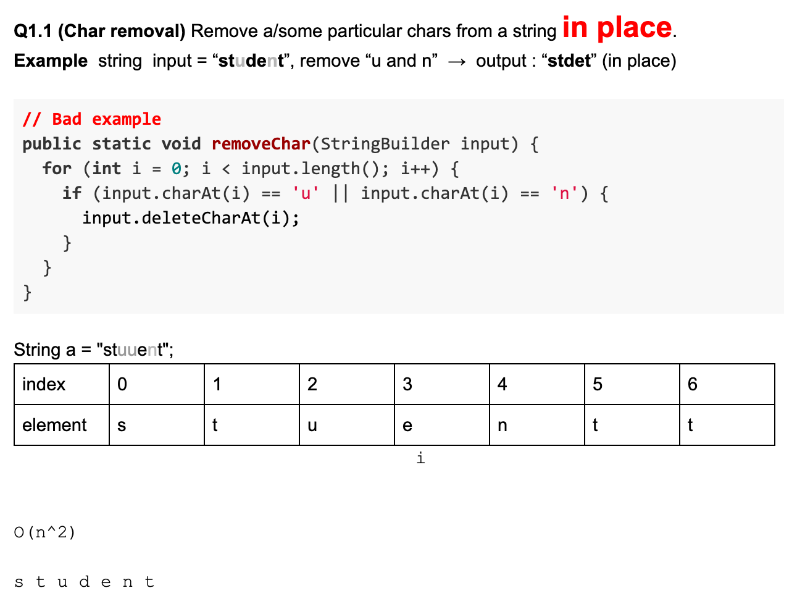
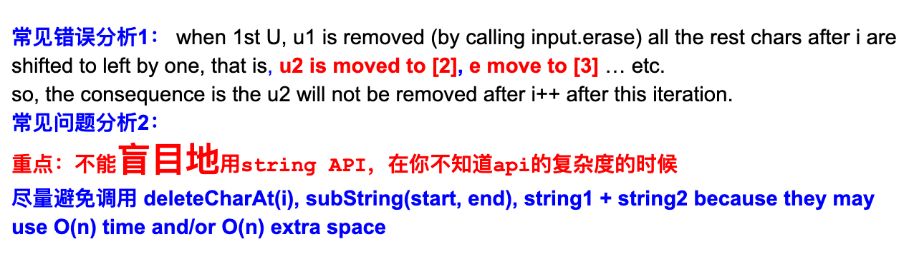
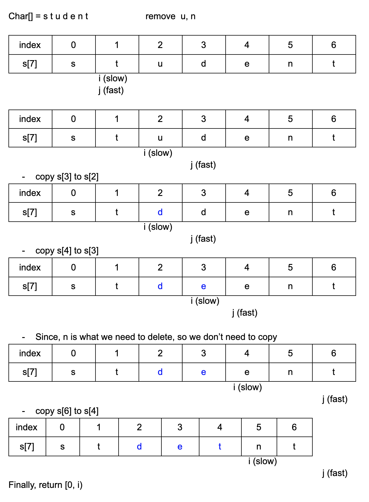

## m8: Remove Certain Characters

- Remove given characters in input string, the relative order of other characters should
  be remained. 
- Return the new string after deletion.

- Assumptions:
  The given input string is not null.
  The characters to be removed is given by another string, it is guaranteed to be not null.

- Examples
  input = "abcd", t = "ab", delete all instances of 'a' and 'b', the result is "cd"

---




---

## My method: two points




```java
public class Solution {
  public String remove(String input, String t) {
    // Write your solution here
    char[] arr = input.toCharArray();
    Set<Character> set = new HashSet<>();
    set = buildSet(t);

    int slow = 0;
    for(int fast = 0; fast < arr.length; fast++){
      if(!set.contains(arr[fast])){
        arr[slow++] = arr[fast];
      }
    }
    return new String(arr, 0, slow);
  }

  private Set<Character> buildSet(String t){
    Set<Character> set = new HashSet<>();
    char[] temp = t.toCharArray();
    for(Character c : temp){
      set.add(c);  
    }
    return set;
  }
}
```