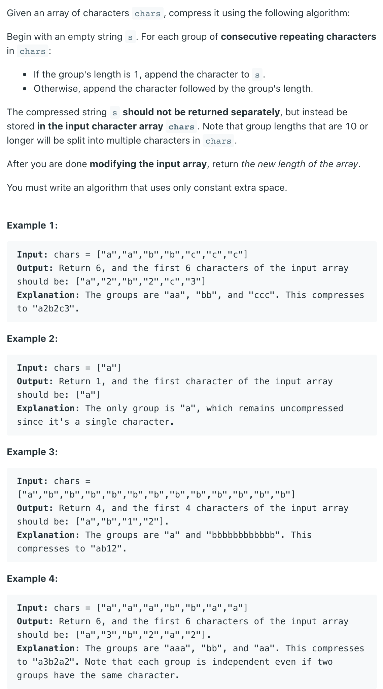
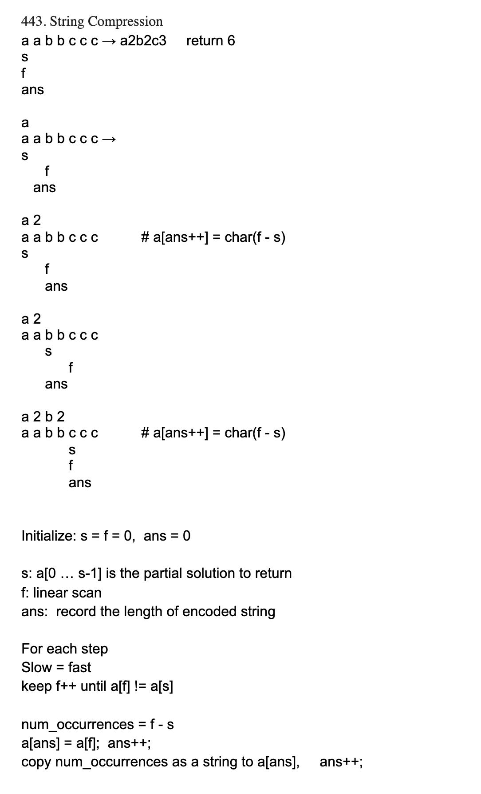

## 443. String Compression





- when a character only occur only one time, means: `fast - slow == 1`
  - **we don't need to count its numbers of occurrences**

```java
class Solution {
    public int compress(char[] chars) {
        int ansIdx = 0;
        int slow = 0;
        int fast = 0;
        while (fast < chars.length) {
            slow = fast;
            while (fast < chars.length && chars[slow] == chars[fast]) {
                fast++;
            }
            chars[ansIdx++] = chars[slow];
            //if: fast - slow == 1, continue
            if (fast - slow == 1) {
                continue;
            }
            for (char c : Integer.toString(fast - slow).toCharArray()) {
                chars[ansIdx++] = c;
            }
        }
        return ansIdx;
        
    }
}
```