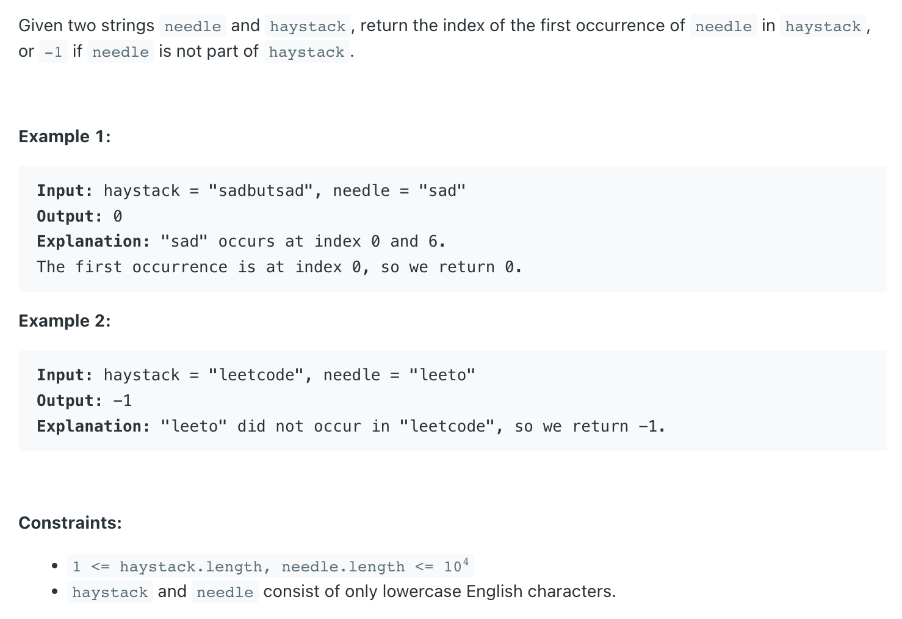

## 28. Find the Index of the First Occurrence in a String  |  Implement strStr()


### Analysis:

- Assume:
  - s1 = "abcde"          s2 = "cde"
  - <U>abc</U>de
  - a<U>bcd</U>e
  - ab<U>cde</U>


```ruby
      0 1 2 3 4 5 6 7 8                 0 1 2  
s1 = [a b c d e f g h i]          s2 = [c d e]
      i->                               j-> #every loop init j = 0

assume i = 2,
           
'c' :  s1.charAt(i + j) == s2.charAt(0)  # j : [0 .. 2]


         
'd' :  s1.charAt(i + j) == s2.charAt(1)


'e' :  s1.charAt(i + j) == s2.charAt(2)
```


- Time = O(m * n)

```java
/*
a  b  c  d  e            c  d  e
i                        j

a  b  c  d  e            c  d  e
   i                     j

a  b  c  d  e            c  d  e
      i                     j

a  b  c  d  e            c  d  e
      i                        j

a  b  c  d  e            c  d  e
      i                          j


*/
class Solution {
    public int strStr(String haystack, String needle) {
        if (haystack == null || needle == null || 
            haystack.length() < needle.length()) {
            return -1;
        }
        if (needle.length() == 0) {
            return 0;
        }
        
        for(int i = 0; i <= haystack.length()-needle.length(); i++){
           int j = 0;
           while(j < needle.length() && haystack.charAt(i + j) == needle.charAt(j)) {
               j++;
           }
           if (j == needle.length()) {
               return i;
           } 
        }
        return -1;
    }
}
```

---

### Solution 2:  O(m) Rabin-Karp

```ruby
hash(c d e) = 1434

a  b  c  d  e
      _______

hash(abc) = 28 
hash(bcd) = 731 
hash(cde) = 1434

O(1) to calculate hash()

a -> 0
b -> 1
c -> 2
d -> 3
...
z -> 25


hash(c d e) = 1434
     2 * 26^2 + 3 * 26 + 4 = 1434

hash(abc) = 0 * 26^2 + 1 * 26   + 2 = 28
hash(bcd) =            1 * 26^2 + 2 * 26   + 3 = 731 
hash(cde) =                       2 * 26^2 + 3 * 26 + 4 = 1434       

O(1) to calculate hash()

1. remove the leftmost item from the hash function
2. all the rest items * 26
3. add new item 
```

- Time = O(m) in average [和 KMP 方法不相上下]

---

```java
public class Solution {     //Method2: Rabin Karp
  public final static int d = 256;
  
  public int strstr(String large, String small) {
    if(large.length() < small.length()){
      return -1;
    }
    if(small.length() == 0) {
      return 0;
    }
    int S = small.length();
    int L = large.length();
    int p = 0; // hash value for pattern -> samll
    int t = 0; // hash value for text -> large
    int pow = 1; // d^(m-1)   
    int MOD = 101; // prime
    // The value of h would be "pow(d, M-1)%q"
    for (int i = 0; i < S - 1; i++){
      pow = (pow * d) % MOD;
      //ex: ((1 * 31) * 31) * 31 = 31^3
    }

    // Calculate the hash value of pattern(small) 
    // and first window of text(large)
    for (int i = 0; i < S; i++) {
      p = (p * d + small.charAt(i)) % MOD;
      t = (t * d + large.charAt(i)) % MOD;
    }

    // Slide the pattern over text one by one
    for (int i = 0; i <= L - S; i++) {
      // Check the hash values of current window of text (large)
      // and pattern(small). If the hash values match then only
      // check for characters one by one
      if (p == t && equals(large, i, small)) {
        return i;
      }
      if (i < L - S) {
        t = (d * (t - large.charAt(i)*pow) + large.charAt(i+S)) % MOD;
        if (t < 0) {
          t += MOD;
        }
      }
    }
    return -1;
  }

  //check pat[0...M-1] == txt[i, i+1, ...i+M-1]
  public boolean equals(String large, int start, String small) {
    for (int i = 0; i < small.length(); i++) {
      if (large.charAt(i + start) != small.charAt(i)) {
        return false;
      }
    }
    return true;
  }
}
```