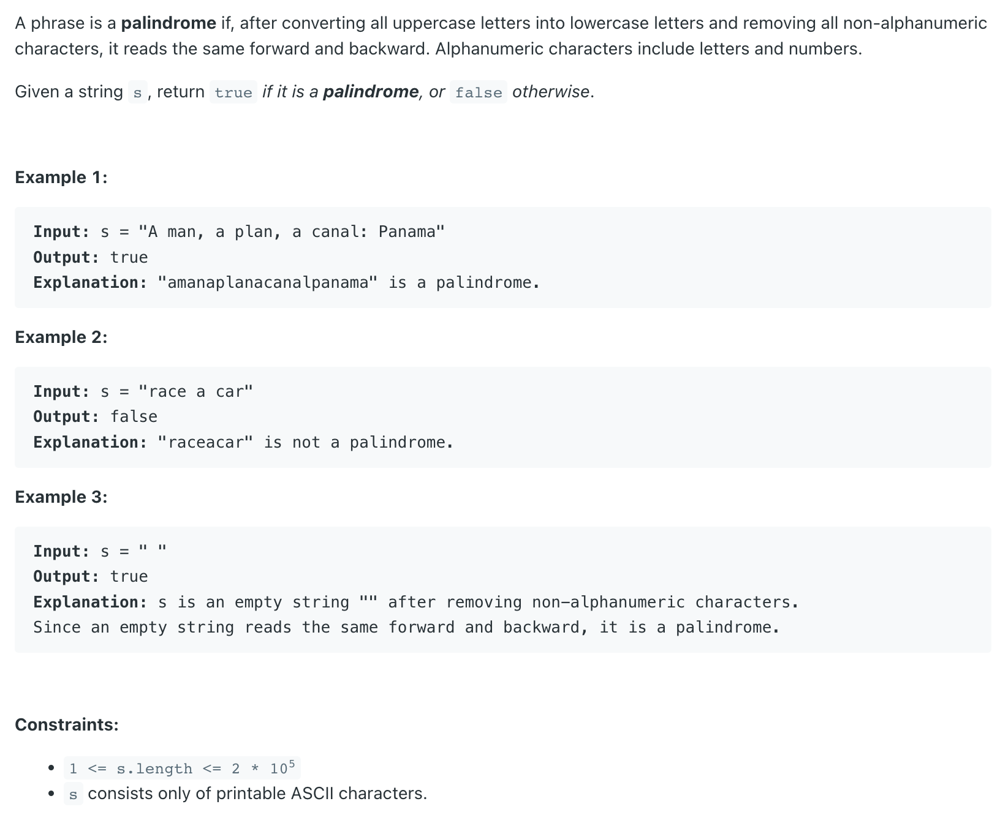

## 125. Valid Palindrome


```java
class Solution {
    public boolean isPalindrome(String s) {
        s = s.toLowerCase();
        StringBuilder sb = new StringBuilder();
        for (char c : s.toCharArray()) {
            if (c == ' ') {
                continue;
            }
            if (Character.isLetterOrDigit(c)) {
                sb.append(c);
            }
        }
        
        int left = 0, right = sb.length() - 1;
        while (left < right) {
            if (sb.charAt(left) != sb.charAt(right)) {
                return false;
            }
            left++;
            right--;
        }
        return true;
    }
}
```

---

### Regular Expression

```java
    public boolean isPalindrome_regularExpression(String s) {
        String res = s.replaceAll("[^a-zA-Z0-9]", "");
        int l = 0, r = res.length() - 1;
        while (l < r) {
            if (res.charAt(l) != res.charAt(r)) {
                return false;
            }
            l++;
            r--;
        }
        return true;
    }
```