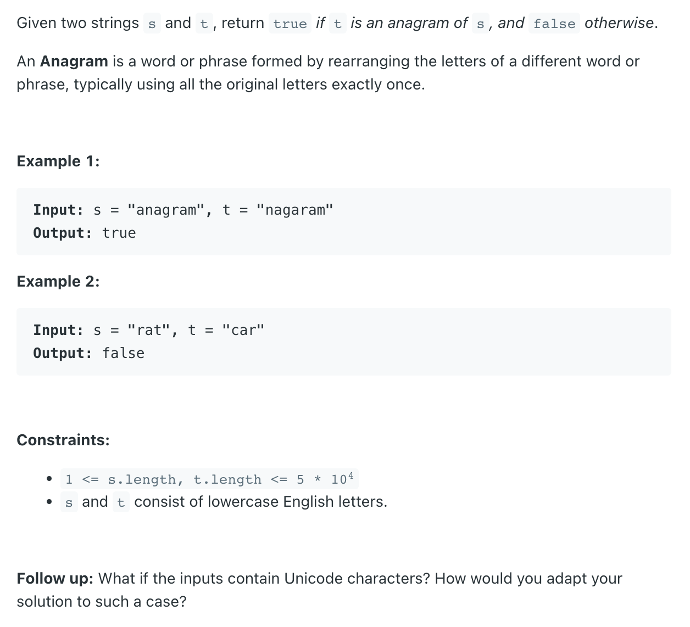

## 242. Valid Anagram


---

- METHOD 1

```java
public class ValidAnagram_v1 {
    public boolean isAnagram(String s, String t) {
        Map<Character, Integer> ms = new HashMap<>();
        Map<Character, Integer> mt = new HashMap<>();

        for (Character c : s.toCharArray()) {
            ms.put(c, ms.getOrDefault(c, 0) + 1);
        }
        for (Character c : t.toCharArray()) {
            mt.put(c, mt.getOrDefault(c, 0) + 1);
        }

        return Objects.equals(ms, mt);
    }
}
```
---

- METHOD 2

```java
class Solution {
    public boolean isAnagram(String s, String t) {
        if (s.length() != t.length()) return false;
        
        int[] sFreq = new int[128];
        int[] tFreq = new int[128];
        for (char c : s.toCharArray()) {
            sFreq[c]++;
        }
        for (char c : t.toCharArray()) {
            tFreq[c]++;
        }
        boolean res = Arrays.equals(sFreq, tFreq);
        return res;
    }
}
```
---

### Python

```py
class Solution:
    def isAnagram(self, s: str, t: str) -> bool:
        if len(s) != len(t):
            return False
        
        countS, countT = {}, {}
        
        for i in range(len(s)):
            countS[s[i]] = countS.get(s[i], 0) + 1
            countT[t[i]] = countT.get(t[i], 0) + 1
        
        for c in countS: 
            if countS[c] != countT.get(c, 0):
                return False
        
        return True
```