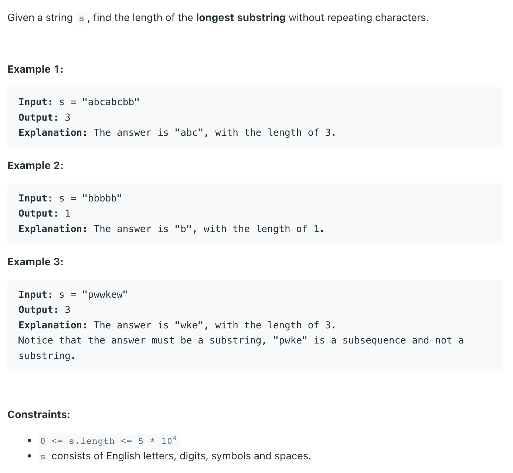
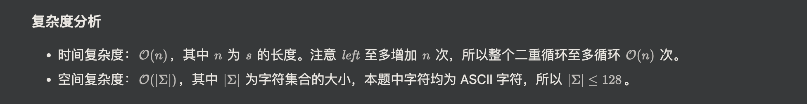

## 3. Longest Substring Without Repeating Characters

---
### Sliding Window    |  哈希表（整形数组）

- 注意： Counter 可以直接写 `cnt[c] += 1`, 而 `dict` 不行

```py
class Solution:
    def lengthOfLongestSubstring(self, s: str) -> int:
        res = 0
        cnt = Counter()  # hashmap char int
        left = 0
        for right, c in enumerate(s):
            cnt[c] += 1
            while cnt[c] > 1:
                cnt[s[left]] -= 1
                left += 1
            res = max(res, right - left + 1)
        return res
```



- SC: O(|∑|), ASCII valus |∑| <= 128
---

### 哈希集合（布尔数组）

```py
class Solution:
    def lengthOfLongestSubstring(self, s: str) -> int:
        maxLen = 0
        window = set()
        left = 0
        
        for right, c in enumerate(s):
            while c in window:
                window.remove(s[left])
                left += 1
            window.add(c)
            maxLen = max(maxLen, right - left + 1)
        return maxLen
```