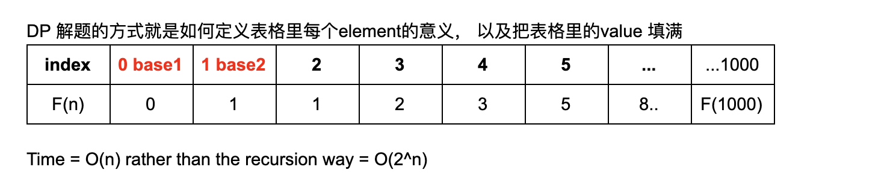
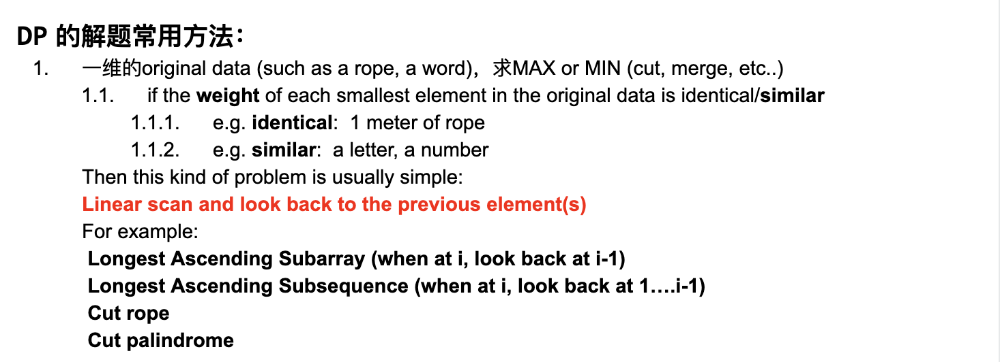

# 509. Fibonacci Number

```ruby
The Fibonacci numbers, commonly denoted F(n) form a sequence, called the Fibonacci sequence, 
such that each number is the sum of the two preceding ones, starting from 0 and 1. That is,

F(0) = 0,   F(1) = 1
F(N) = F(N - 1) + F(N - 2), for N > 1.

Example 1:
Input: 2
Output: 1
Explanation: F(2) = F(1) + F(0) = 1 + 0 = 1.


Example 2:
Input: 3
Output: 2
Explanation: F(3) = F(2) + F(1) = 1 + 1 = 2.

Example 3:
Input: 4
Output: 3
Explanation: F(4) = F(3) + F(2) = 2 + 1 = 3.
```


## Analysis:

- 我们知道如果用递归 `O(n!)`

- Fibonacci: `F(n) = F(n - 1) + F(n - 2)`

- Base case:
- F(0) = 0
- F(1) = 1

```java
public int fibonacci(int n = 1000){
    if(n == 0 || n == 1){
        return n;
    }
    return fibonacci(n - 1) + fibnoacci(n - 2);
}
```


#### Optimization: Recursion + Memoization
- Use a `HashMap<key = n, value = Fib(n)>`

```java
public int fibN(int n = 1000, HashMap<Integer, Integer> m){
    if(n == 0 || n == 1){
        return n;
    }
    if(m.containsKey(n)){
        return m.get(n);
    }

    int result = fibN(n - 1) + fibN(n - 2);
    m.put(n, result);
    return result;
}
```


### DP 解题



- DP 的**核心思想**类似于数学归纳法：
  - 把一个大问题 （size == n）的解决方案用比他小的问题来解决，也就是思考从问题size = n-1 增加到size = n的时候，
    如何用小问题的solution构建大问题的solution.
  - 与 recursion 的关系：
    - Recursion 从大到小来解决问题，不记录任何sub-solution,只要考虑
      - **base case**
      - recursive rule
    - DP 从小到大来解决问题，记录sub-solution
      - 由size < n 的 subsolution(s) -> size(n) 的solution
      - **base case**
      - induction rule





## My solution

```java
class Solution {
    public int fib(int N) {
        if(N <= 0){
            return 0;
        }
        int[] array = new int[N + 1];
        array[0] = 0;
        array[1] = 1;
        for(int i = 2; i <= N; i++){
            array[i] = array[i - 1] + array[i - 2];
        }
        return array[N];
    }
}
```


---

## 更好的方法：dp solution with O(1) space.

```java
public long fibonacci(int k){
    long a = 0;
    long b = 1;
    if(k <= 0){
        return 0;
    }
    while(k > 1){
        long temp = a + b;
        a = b;
        b = temp;
        k--;
    }
    return b;
}
```