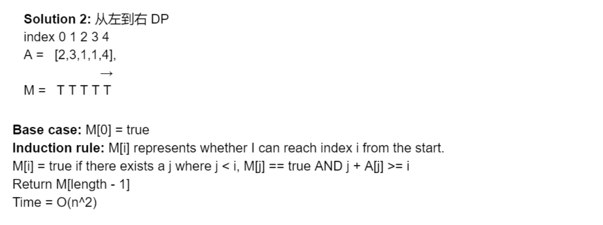

## 55. Jump Game

---
### Analysis



```java
// Method 2: DP, canJump[i] means from index `0`, can jump to index i.
public class Solution2 {
    public boolean canJump(int[] nums) {
        int n = nums.length;
        boolean[] dp = new boolean[n];
        dp[0] = true;
        for (int i = 1; i < n; i++) {
            for (int j = 0; j < i; j++) {
                // if index j is reachable from index 0, and from index j
                // it is possible to jump to index i.
                if (dp[j] && nums[j] + j >= i) {
                    dp[i] = true;
                    break;
                }
                System.out.println();
            }
        }
        return dp[n - 1];
    }

    public static void main(String[] args) {
        int[] nums = {2, 3, 1, 1, 4};
        Solution2 solution2 = new Solution2();
        boolean res = solution2.canJump(nums);
        System.out.println(res); // true
    }
}
```

---
```ruby
from right hand side to left hand side DP


index   0   1   2   3   4
A   =  [2   3   1   1   4]
                        <- 
m   =                   T


index   0   1   2   3   4
A   =  [2   3   1   1   4]
                        <- 
m   =               T   T


index   0   1   2   3   4
A   =  [2   3   1   1   4]
                        <- 
m   =           T   T   T


index   0   1   2   3   4
A   =  [2   3   1   1   4]
                        <- 
m   =       T   T   T   T


index   0   1   2   3   4
A   =  [2   3   1   1   4]
                        <- 
m   =   T   T   T   T   T
```

---


- Base case: M[4] = true, becuase A[4] is target itself.
- Induction rule: 
  - M[i] represents whether I can jump from the `i-th` element to the target element.
  - M[i] = true   if   `Ej`   `M[j] == true`  OR  `i + A[j] >= target`
    `i < j <= i + A[i]`
    如果我能从 i 跳到某个中继站 j 而且已经知道 j 能够到达终点了
    **falese otherwise**
  - Time = O(n^2)

---

```java
class Solution {
    public boolean canJump(int[] nums) {
        if (nums.length == 1) {
            return true;
        }
        int len = nums.length;
        boolean[] canJump = new boolean[len];
        
        for (int i = len - 2; i >= 0; i--) {
            if (i + nums[i] >= len - 1) {
                canJump[i] = true;
            } else {
                for (int j = nums[i]; j >= 0; j--) {
                    if (canJump[j + i]) {
                        canJump[i] = true;
                        break;
                    }
                }
            }
        }
        return canJump[0];
    }
}
```


---

## 更优解：

```java
class Solution {
    public boolean canJump(int[] nums) {
        if (nums == null || nums.length == 0) {
            return true;
        }
        int max = 0;
        for (int i = 0; i < nums.length; i++) {
            if (max < i) {
                return false;
            }
            max = Math.max(nums[i] + i, max);
        }
        return true;
    }

    public static void main(String[] args) {
        Solution solution = new Solution();
        int[] nums = new int[]{2, 3, 1, 1, 4};
        System.out.println(solution.canJump(nums));// true
    }
}
```


- 核心思想： Array[i] + currentIndex >= currentIndex;
- 否则如何跳到最后呢？ 😂