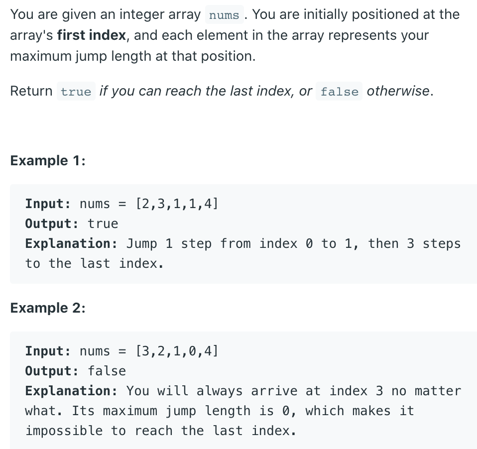

## 55. Jump Game


### Analysis

```ruby
from right hand side to left hand side DP


index   0   1   2   3   4
A   =  [2   3   1   1   4]
                        <- 
m   =                   T


index   0   1   2   3   4
A   =  [2   3   1   1   4]
                        <- 
m   =               T   T


index   0   1   2   3   4
A   =  [2   3   1   1   4]
                        <- 
m   =           T   T   T


index   0   1   2   3   4
A   =  [2   3   1   1   4]
                        <- 
m   =       T   T   T   T


index   0   1   2   3   4
A   =  [2   3   1   1   4]
                        <- 
m   =   T   T   T   T   T
```

---


- Base case: M[4] = true, becuase A[4] is target itself.
- Induction rule: 
  - M[i] represents whether I can jump from the `i-th` element to the target element.
  - M[i] = true   if   `Ej`   `M[j] == true`  OR  `i + A[j] >= target`
    `i < j <= i + A[i]`
    如果我能从 i 跳到某个中继站 j 而且已经知道 j 能够到达终点了
    **falese otherwise**
  - Time = O(n^2)

---

```java
class Solution {
    public boolean canJump(int[] nums) {
        if (nums.length == 1) {
            return true;
        }
        int len = nums.length;
        boolean[] canJump = new boolean[len];
        
        for (int i = len - 2; i >= 0; i--) {
            if (i + nums[i] >= len - 1) {
                canJump[i] = true;
            } else {
                for (int j = nums[i]; j >= 0; j--) {
                    if (canJump[j + i]) {
                        canJump[i] = true;
                        break;
                    }
                }
            }
        }
        return canJump[0];
    }
}
```


---

## 更优解：

```java
class Solution {
    public boolean canJump(int[] nums) {
        if(nums == null || nums.length == 0){
            return true;
        }
        int max = 0;
        for(int i = 0; i < nums.length; i++){
            if(i > max){
                return false;
            }
            max = Math.max(nums[i] + i, max);
        }
        
        return true;
    }
}

```


- 核心思想： Array[i] + currentIndex >= currentIndex;
- 否则如何跳到最后呢？ 😂