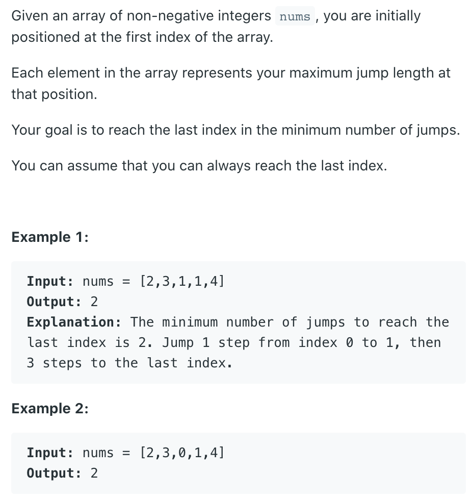
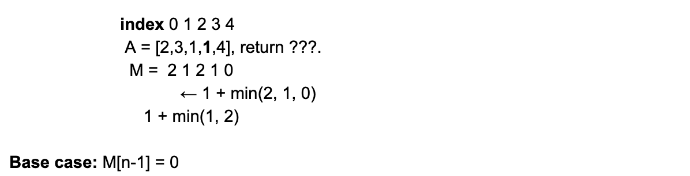

## 45. Jump Game II




- Induction rule:
  - M[i], represents the min. numbers of jumps from the i-th element to the last element.
  - M[i] = min(M[j]) + 1 , where `i < j <= i + A[i]`

### Analysis

- **Base case**: M[n] = 0

```ruby
from right hand side to left hand side DP

index   0   1   2   3   4
A   =  [2   3   1   1   4]
                        <- 
m   =                   0


index   0   1   2   3   4
A   =  [2   3   1   1   4]
                    <- 
m   =               1   0


index   0   1   2   3   4
A   =  [2   3   1   1   4]
                <- 
m   =           2   1   0


index   0   1   2   3   4
A   =  [2   3   1   1   4]
            <- 
m   =       1   2   1   0


index   0   1   2   3   4
A   =  [2   3   1   1   4]
        <- 
m   =   2   1   2   1   0
```
