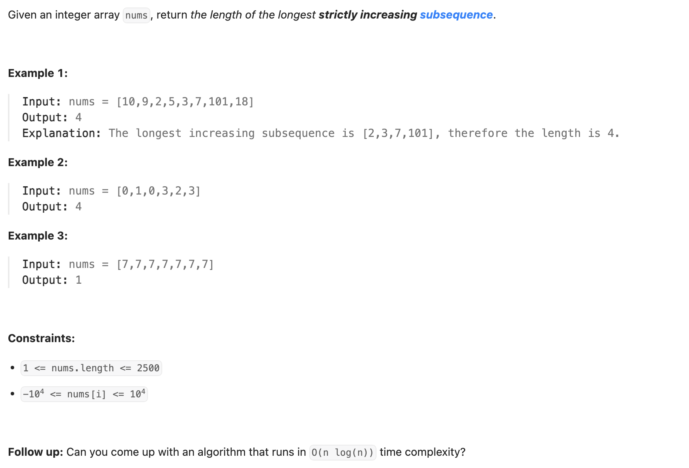
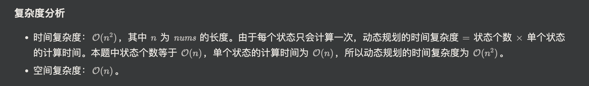

## 300. Longest Increasing Subsequence

---

### memorization

```py
class Solution:
    def lengthOfLIS(self, nums: List[int]) -> int:

        @cache
        def dfs(index) -> int:
            res = 0
            for j in range(index):
                if nums[j] < nums[index]:
                    res = max(res, dfs(j))
            return res + 1

        return max(dfs(i) for i in range(len(nums)))
```

---

### DP


- **dfs(i)** 表示以 nums[i] 结尾的**最长递增子序列（LIS）的长度**。
- 枚举**subsequence**的倒数第二个数的下标是 **j**，如果 **nums[j] < nums[i]**，那么有:
                                                        **dfs(i) = dfs(j) + 1**


```ruby
Example:
                            j           i
        nums = [1   6   7   2   4   5   3]


        dfs(i) = max{dfs(j)} + 1          注意这里的 + 1， 是加上自己 "nums[i]"
```


```py
class Solution:
    def lengthOfLIS(self, nums: List[int]) -> int:
        dp = [0] * len(nums)

        for i in range(len(nums)):
            for j in range(i):
                if nums[j] < nums[i]:
                    dp[i] = max(dp[i], dp[j])
            dp[i] += 1
        return max(dp)
```