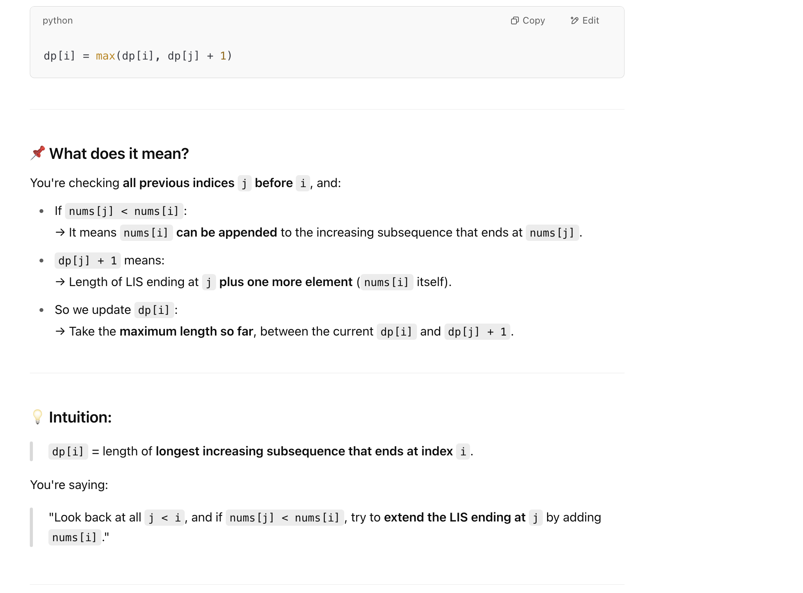

## 300. Longest Increasing Subsequence

---

### memorization

```py
class Solution:
    def lengthOfLIS(self, nums: List[int]) -> int:

        @cache
        def dfs(index) -> int:
            res = 0
            for j in range(index):
                if nums[j] < nums[index]:
                    res = max(res, dfs(j))
            return res + 1

        return max(dfs(i) for i in range(len(nums)))
```


---

### Memorization

```py
class Solution:
    def lengthOfLIS(self, nums: List[int]) -> int:

        @cache
        def dfs(index) -> int:
            res = 1
            for j in range(index):
                if nums[j] < nums[index]:
                    res = max(res, dfs(j) + 1)
            return res

        return max(dfs(i) for i in range(len(nums)))
```
---





### dp 第二种写法

```py
class Solution:
    def lengthOfLIS(self, nums: List[int]) -> int:
        dp = [1] * len(nums)

        for i in range(1, len(nums)):
            for j in range(i):
                if nums[j] < nums[i]:
                    dp[i] = max(dp[i], dp[j] + 1)
        return max(dp)
```