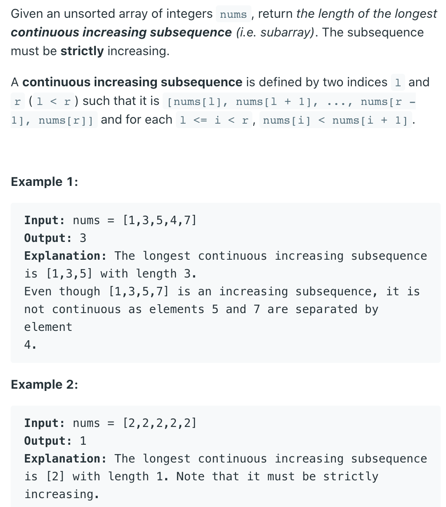

## 674. Longest Continuous Increasing Subsequence | Longest Ascending SubArray



### Analysis:


- input[i - 1] < input[i], `继承遗产 + 1`
- input[i - 1] >= input[i], `另起炉灶`


- Time O(n)
- Space = O(n) -> 0(1) if we can optimize it


## Ans:

```java
class Solution {
    public int findLengthOfLCIS(int[] nums) {
        if(nums == null || nums.length == 0){
            return 0;
        }
        //dp[i] = 1     (array[i] <= array[i - 1])
        //dp[i] = dp[i - 1] + 1       (array[i] > array[i - 1])
        //so we can make the space consumption more efficient by only
        //recording the latest dp[i]
        int cur = 1;
        int result = 1;
        for(int i = 1; i < nums.length; i++){
            if(nums[i] > nums[i - 1]){
                //the second case, we can update dp[i]
                cur++;
                result = Math.max(cur, result);
            }else{
                //the first case, we need to reset dp[i]
                cur = 1;
            }
        }
        return result;
    }
}
```