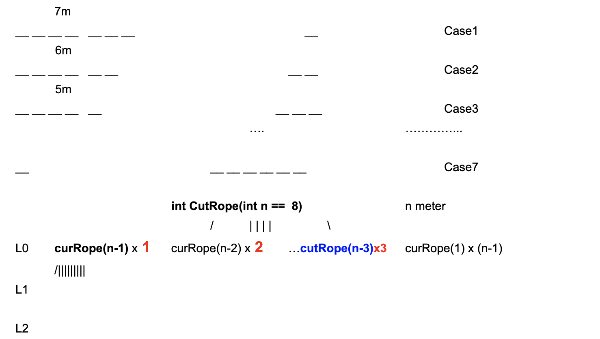
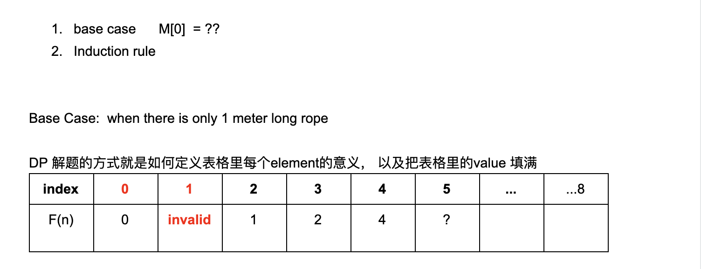
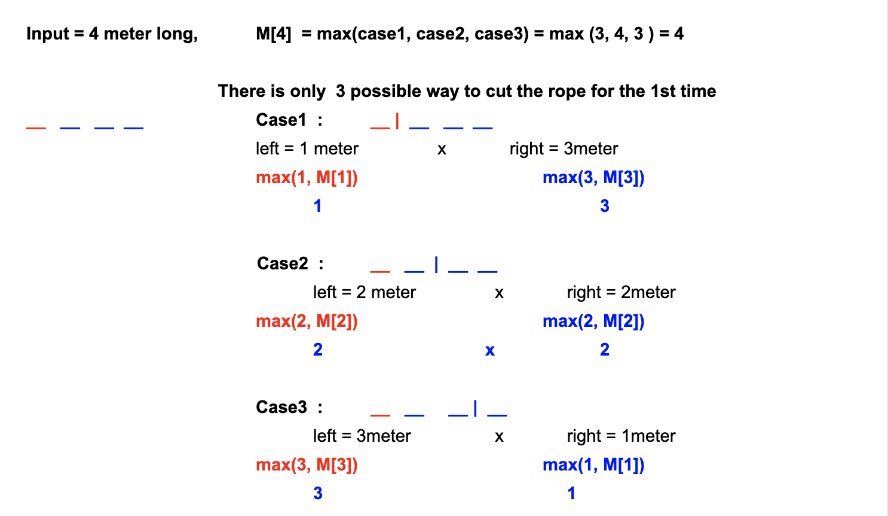
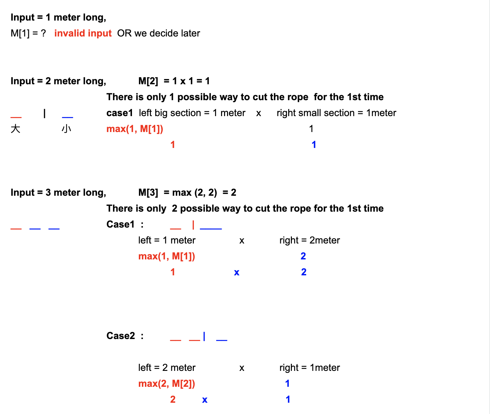
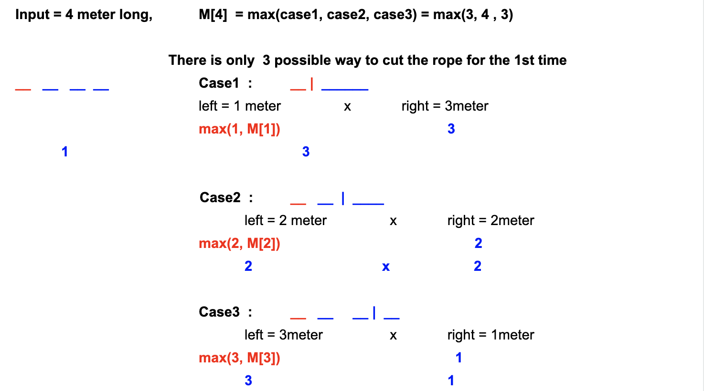

# Max Product Of Cutting Rope

```ruby
Given a rope with positive integer-length n, 
how to cut the rope into m integer-length parts with length p[0], p[1], ...,p[m-1], 
in order to get the maximal product of p[0]*p[1]* ... *p[m-1]? m is determined by you 
and must be greater than 0 (at least one cut must be made). Return the max product you can have.

Assumptions

n >= 2

Examples
n = 12, the max product is 3 * 3 * 3 * 3 = 81(cut the rope into 4 pieces with length of each is 3).
```


## Analysis:

- Method0: (NOT so good idea), we can use DFS to solve this problem



- 但是这样做最大缺点是：`O(n!)`


- Method1: DP(Liner scan and lock back)
- DP(左大段 + 右大段)思想




```java
Input = 1 meter long.
M[1] = ? invalid input OR we decide later


Input = 2 meter long,   M[2] = 1 * 1 = 1
                    There is only 1 possible way to cut the rope for the 1st time
_ | _               case1 left = 1 meter            x           right = 1 meter
                            max(1, M[1])                            max(1, M[1])     
                                  1                                       1     


Input = 3 meter long,   M[3] = max(case1, case2) = max(2, 2) = 2 
                    There is only 2 possible way to cut the rope for the 1st time
                    case2:  _ _ | _           
                            left = 2 meter           x           right = 1 meter
                            max(2, M[2])                            max(1, M[1])     
                            2           x           1
```



```java
for(int i = 1; i<=n; i++){
    for(look back to all possible cut position){
        ...
    }
}
```

- Time = O(n^2)

---

## Solution 1 : DP (左大段 + 右小段) 思想 is more general  and can be used to solve more general problems.




```java
左大右小 思维
假设8米绳子

Left	         right
1      ------       7
2      ------       6
3      ------       5
4      ------       4  	//这里可以发现 已经 左右对称
5      ------       3	//为什么 左大右小 思维 => 只需要处理左边部分， 因为很明显可以做个假设，
//假如我们把   5------3 ⇔  3------5  ，那么你会发现其实3已经被曾经的“历史”处理过了。 所以我们一路处理左大段 就行！
6      ------       2
7      ------       1

```


```java
public class Solution {
  public int maxProduct(int length) {
    // Write your solution here
    int[] M = new int[length + 1];
    M[0] = 0;
    M[1] = 0;
    for(int i = 1; i <= length; i++){
      int curMax = 0;
      for(int j = 1; j < i; j++){
        curMax = Math.max(curMax, Math.max(j, M[j]) * (i - j));
      }
      M[i] = curMax;
    }
    return M[length];
  }
}

```