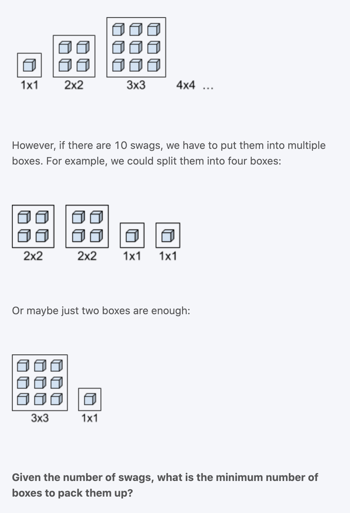

# Packing Up the Swags | Interview

```ruby
Our company is going to distribute swags at the recruiting event. 
We will put the swags into square-shaped boxes. 
Each box has to be completely filled so that the swags wouldn’t break during transportation. 
For example, a box can contain 1 swag, 4 swags, 9 swags, etc. (The boxes can be sufficiently large.)
```



## Analysis

```ruby
Clarification:
input: int swag
output: int min number of boxes

Assumption: swag > 0

Dynamic Programming:

[1  2  3  4  5  6  7  8  9  10]
  1  2  3  1  2  3  4  2  1   

e.g. if  input = 7, then minNum =  swag(4) + swag(1) + swag(1) + swag(1) = 7

M[i] represents the min number of boxes for i number of swags

base case: M[0] = 0

induction rule: 
M[i] = min(M[i - j * j] + 1)   where i <= j <= max square can be

Time = O(n^2) => as for each i, need to look at sqrt(i) the previous memo in the worst case.
Space = O(n)
```

## implementation

```java
public class packingUpSwags {
    public int minBoxes(int swag) {
        int[] min = new int[swag + 1];

        //base case
        min[0] = 0;

        //induction rule
        for (int i = 1; i < min.length; i++) {
            min[i] = i;//4
            for (int j = 1; j * j <= i; j++) {//2
                min[i] = Math.min(min[i - j * j] + 1, min[i]); //1, 4 => 1
            }
        }
        return min[swag];
    }

    public static void main(String[] args) {
        packingUpSwags pus = new packingUpSwags();
        int min = pus.minBoxes(7);
        System.out.println(min); //4
    }
}
```