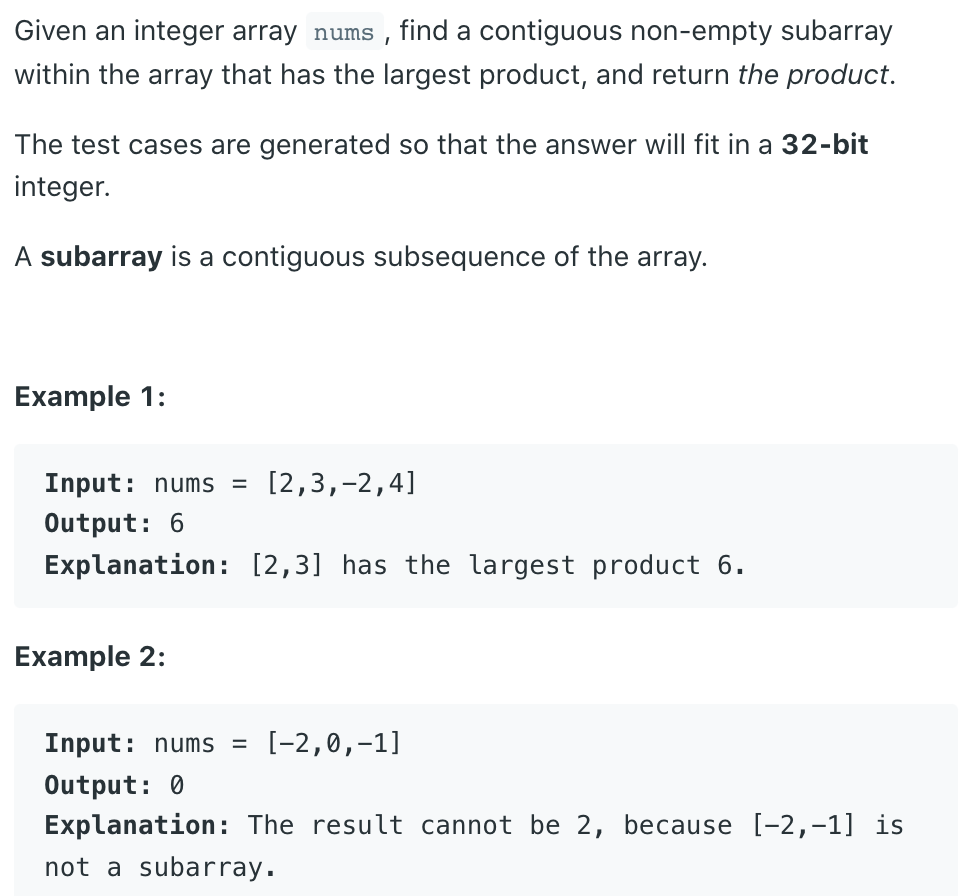
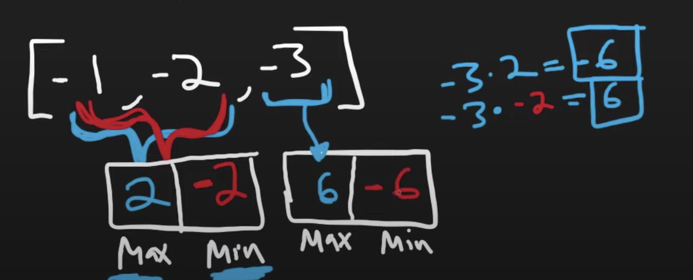

## 152. Maximum Product Subarray



- It's easy to handle positive array
  - [1, 5, 3, 4]
  - because the product, is always increasing
    - `1 * 5 * 3 * 4`
- It's hard to solve this problem with negative array
  - e.g. [-1, -2, -3]
  - `-1 * -2 = 2`,  `-1 * -2 * -3 = -6`
  - so we know the sign is alternating
  - if we get `-2 * -3 = 6`, we get a positive 6
  

  - so we need to find both `max` and `min`

  - Now, we have edge case: `0`

  - why we set to be `1` ?
    - because when we introducing new values: 
      - 1 * 3 = 3

---


```ruby
max = 1, min = 1
res = MIN_VALUE
            [2   -2   3    2   -3    5]
+Product:    2   -2   3    6   72   360
-Product:    2   -4  -12  -24  -18  -90 
```


```java
class Solution {
    public int maxProduct(int[] nums) {
        if (nums == null || nums.length == 0) {
            return 0;
        }
        int max = 1;
        int min = 1;
        int res = Integer.MIN_VALUE;
        for (int i = 0; i < nums.length; i++) {
            if (nums[i] < 0) {
                int temp = max;
                max = min;
                min = temp;
            }
            max = Math.max(max * nums[i], nums[i]);
            min = Math.min(min * nums[i], nums[i]);
            res = Math.max(max, res);
        }
        return res;
    }
}
```