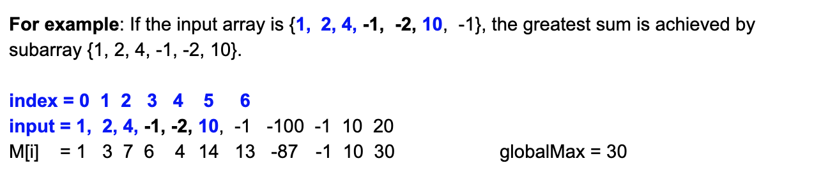
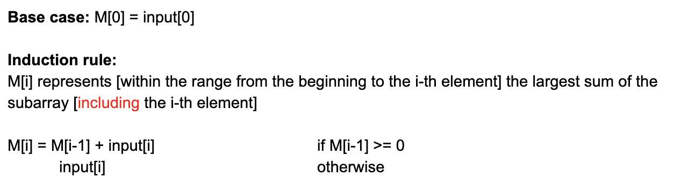
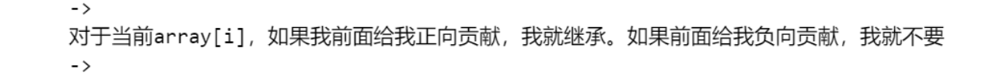

## 53. Maximum Subarray      |       Largest SubArray Sum

---

## Analysis





- T = O(n)
- Space = O(n)


```java
class Solution {
    public int maxSubArray(int[] nums) {
        if(nums == null || nums.length == 0){
            return 0;
        }
        int[] dp = new int[nums.length];
        dp[0] = nums[0];
        int globalMax = nums[0];
        for(int i = 1; i < nums.length; i++){
            dp[i] = Math.max(dp[i - 1] + nums[i], nums[i]);
            globalMax = Math.max(dp[i], globalMax);
        }
        return globalMax;
    }
}
```