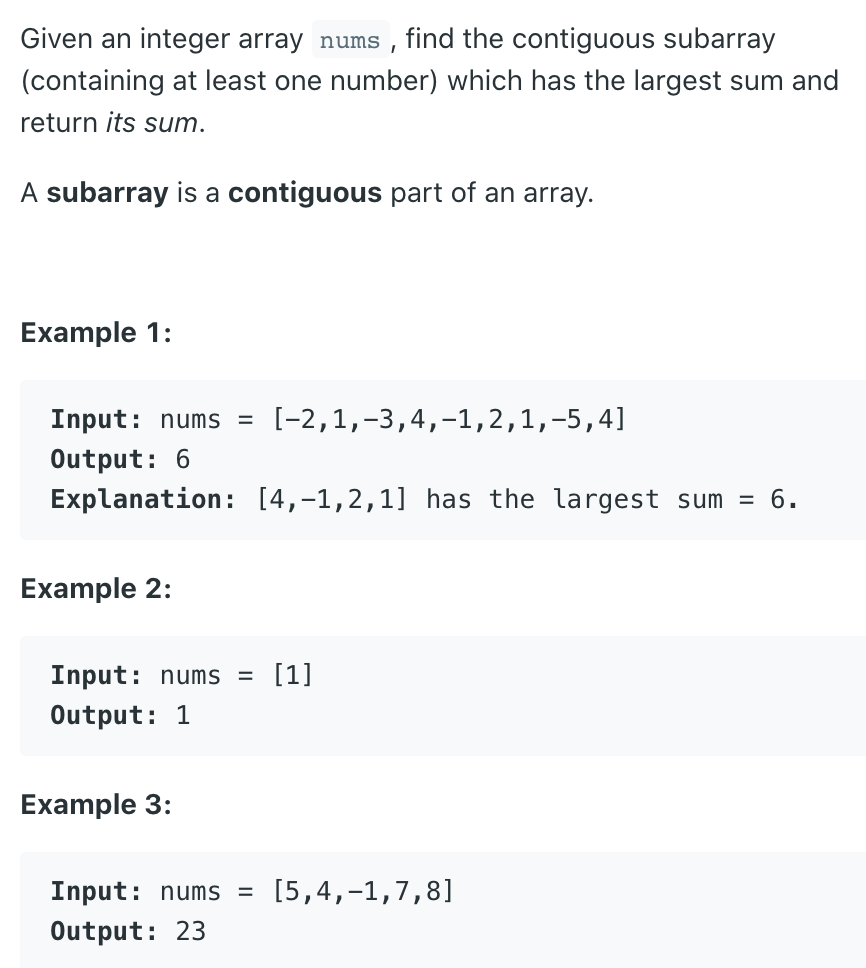

## 53. Maximum Subarray      |       Largest SubArray Sum

---

## Analysis

```ruby
index = 0   1   2   3   4   5   6   7   8
input:[-2   1  -3   4  -1   2   1  -5   4]
M[i] = -2   1  -2   4   3   5   6   1   5               globalMax = 6

Base case: M[0] = input[0]

Induction rule:
M[i] represents [within the range from the beginning to the i-th element] the largest sum of the
subarray [including the i-th element]

M[i] = M[i - 1] + input[i]                      if M[i - 1] >= 0
input[i]                                        otherwise
```


```java
class Solution {
    public int maxSubArray(int[] nums) {
        if(nums == null || nums.length == 0){
            return 0;
        }
        int[] dp = new int[nums.length];
        dp[0] = nums[0];
        int globalMax = nums[0];
        for(int i = 1; i < nums.length; i++){
            dp[i] = Math.max(dp[i - 1] + nums[i], nums[i]);
            globalMax = Math.max(dp[i], globalMax);
        }
        return globalMax;
    }
}
```