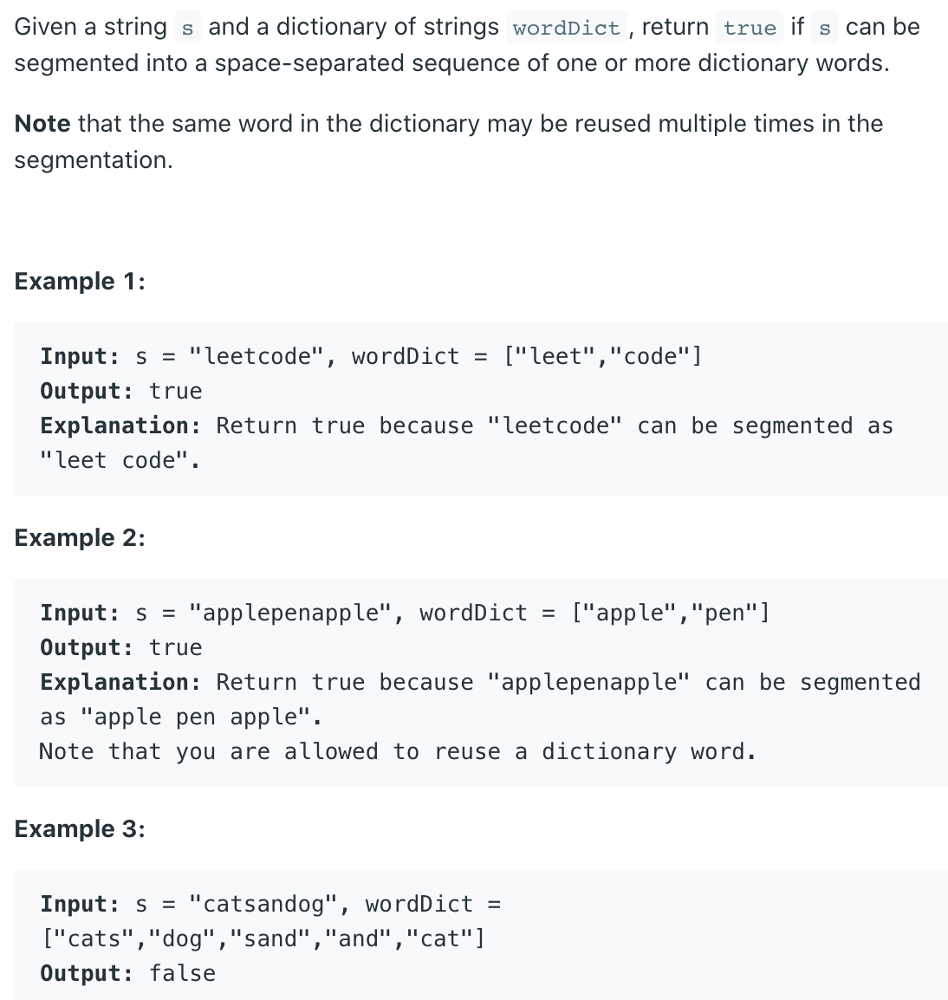
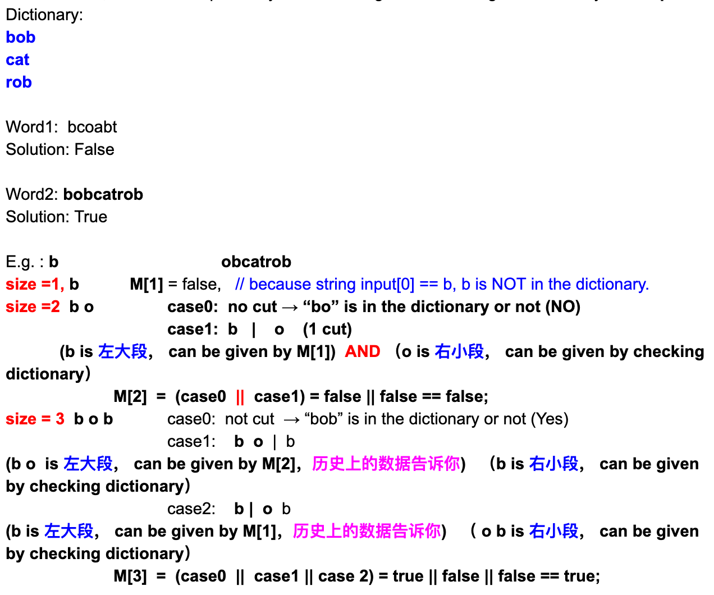
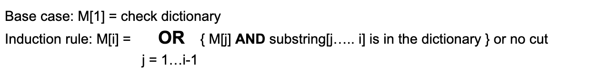

## 139. Word Break | Dictionary Word |


### Analysis:

- **Base Case**: `M[0] = true`  empty string
- Induction rule:
  - `M[i]` represents if we can cut the word[0...i] successfully.
  - `M[1]` "b" = false
  - `M[2]` "bo"
    - no cut => check "bo" => false
    - `b   | o` => 
      M[1]   check "o" => false
  - `M[2]` = false || false = false    
  - `M[3` "bob"
    - no cut => check "bob" => true
    - `bo | b`
      `M[2]`   check "b" => false
    - `b  | ob`  
      `M[1]`  check "ob"  => false
  - `M[3]` = true || false || false = true     
 



```java
Input: s = "applepenapple", wordDict = ["apple","pen"]
  
  0  1  2  3  4  5  6  7  8  9  10 11 12
  a  p  p  l  e  p  e  n  a  p  p  l  e 
                 i  
                 dp[5] = true


  0  1  2  3  4  5  6  7  8  9  10 11 12
  a  p  p  l  e  p  e  n  a  p  p  l  e 
                          i  
                 dp[8] = true


init: dp[0] = true // empty string represents true

wordDict.contains(s.substring(j, i)) && dp[j]
```


```java
class Solution {
    public boolean wordBreak(String s, List<String> wordDict){
        Set<String> dict = new HashSet<>(wordDict);
        int len = s.length();
        boolean[] dp = new boolean[len + 1];
        dp[0] = true; //set empty string to be true, base case
        
        for (int i = 1; i < dp.length; i++) {
            for (int j = 0; j < i; j++) {
                if(dict.contains(s.substring(j, i)) && dp[j]){
                    dp[i] = true;
                    break;
                }
            }
        }
        return dp[len];
    }
}
```
