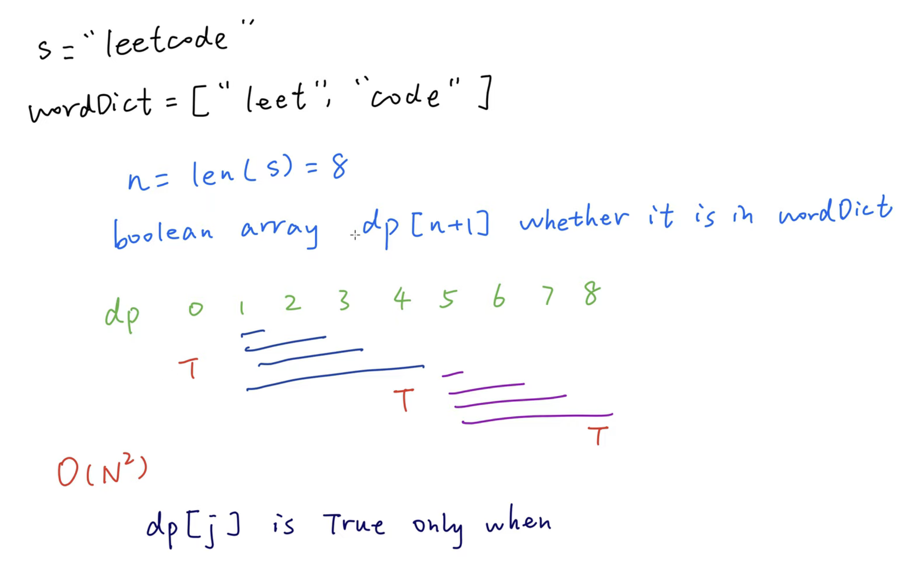

## 139. Word Break | Dictionary Word |


---
### Memorization

```java
class _139_WordBreak_memo_map {
    public boolean wordBreak(String s, List<String> wordDict) {
        Map<Integer, Boolean> memo = new HashMap<>();
        return dfs(s, wordDict, memo, 0);
    }

    private boolean dfs(String s, List<String> wordDict, Map<Integer, Boolean> memo, int index) {
        if (index == s.length()) {
            // Successfully reached the end of the s string.
            return true;
        }
        if (memo.containsKey(index)) {
            // Return the cached result
            return memo.get(index);
        }

        for (String word : wordDict) {
            if (index + word.length() > s.length()) {
                continue;
            }
            // Check if the substring matches the word
            if (s.substring(index, index + word.length()).equals(word)) {
                // Move the index forward by the length of the current word
                if (dfs(s, wordDict, memo, index + word.length())) {
                    memo.put(index, true);
                    return true;
                }
            }
        }

        memo.put(index, false);
        // No valid word break found from this index
        return false;
    }
}
```

---
```java
class Solution {
    public boolean wordBreak(String s, List<String> wordDict) {
        int[] memo = new int[s.length()];
        Arrays.fill(memo, -1);
        return dfs(s, wordDict, memo, 0);
    }
    private boolean dfs(String s, List<String> wordDict, int[] memo, int index) {
        if (index == s.length()) {
            // Successfully reached the end of the s string.
            return true;
        }
        if (memo[index] != -1) {
            // Return the cached result
            return memo[index] == 1;
        }

        for (String word : wordDict) {
            if (index + word.length() > s.length()) {
                continue;
            }
            // Check if the substring matches the word
            if (s.substring(index, index + word.length()).equals(word)) {
                // Move the index forward by the length of the current word
                if (dfs(s, wordDict, memo, index + word.length())) {
                    memo[index] = 1;
                    return true;
                }
            }
        }

        memo[index] = 0;
        // No valid word break found from this index
        return false;
    }
}
```


---

### DP:

- [youTuBe video](https://www.youtube.com/watch?v=KppuKbiBX78)

- **Base Case**: `M[0] = true`  empty string
- Induction rule:
  - `M[i]` represents if we can cut the word[0...i] successfully.
  - `M[1]` "b" = false
  - `M[2]` "bo"
    - no cut => check "bo" => false
    - `b   | o` => 
      M[1]   check "o" => false
  - `M[2]` = false || false = false    
  - `M[3` "bob"
    - no cut => check "bob" => true
    - `bo | b`
      `M[2]`   check "b" => false
    - `b  | ob`  
      `M[1]`  check "ob"  => false
  - `M[3]` = true || false || false = true     
 


---


- 本题的重点： 一整个单词cut, 比如 `"apple"`, `"pen"`, `"apple"`
---
```java
Input: s = "applepenapple", wordDict = ["apple","pen"]
  
  0  1  2  3  4  5  6  7  8  9  10 11 12
  a  p  p  l  e  p  e  n  a  p  p  l  e 
                 i  
                 dp[5] = true


  0  1  2  3  4  5  6  7  8  9  10 11 12
  a  p  p  l  e  p  e  n  a  p  p  l  e 
                          i  
                 dp[8] = true


init: dp[0] = true // empty string represents true

wordDict.contains(s.substring(j, i)) && dp[j]
```
---

```java
class Solution {
    public boolean wordBreak(String s, List<String> wordDict){
        Set<String> dict = new HashSet<>(wordDict);
        int len = s.length();
        boolean[] dp = new boolean[len + 1];
        dp[0] = true; //set empty string to be true, base case
        
        for (int i = 1; i < dp.length; i++) {
            for (int j = 0; j < i; j++) {
                if(dict.contains(s.substring(j, i)) && dp[j]){
                    dp[i] = true;
                    break;
                }
            }
        }
        return dp[len];
    }
}
```
