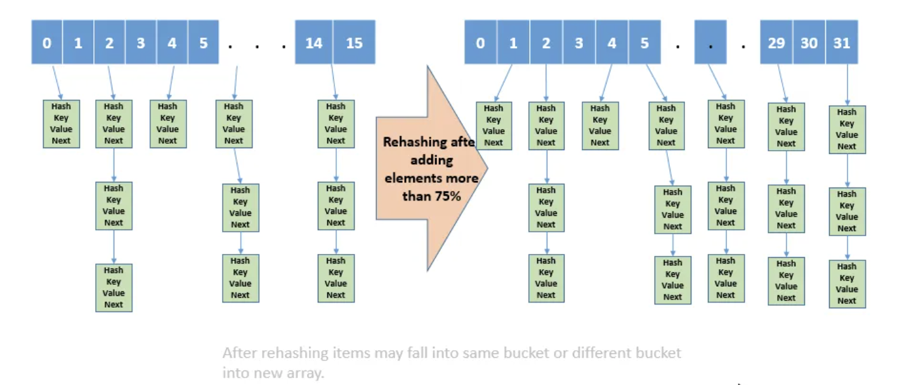
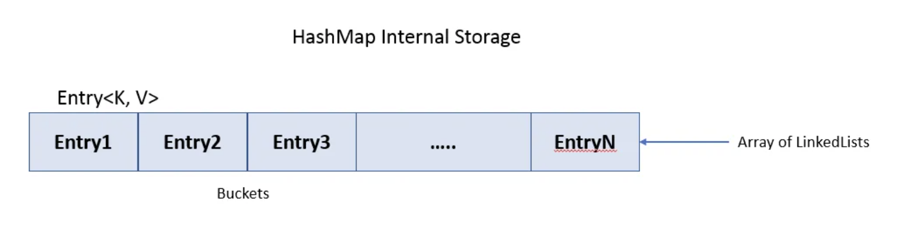

# 2. HashMap Implementation

#### Review About HashMap:

- Where are `equals()` and `hashCode()` from?
  - the difference between `==` and `equals()`
- The contract between `equals()` and `hashCode()`
  - if `o1.equals(o2) == true`, then you have to guarantee `o1.hashCode() == o2.hashCode()`
  - If `o1.hashCode() == o2.hashCode()`, it is not necessary `o1.equals(o2)`
  - hashcode(return address) Wrong
  - hashcode(return 0) Fine in logic, but not good
- The performance of HashMap is controlled by `hashCode()` and load factor
- If `hashCode()` returns the same int value for all the objects, what will happen?
  - It will be transferred to a single linked list.


### Get into a little details about HashMap Implementaion:

- array of entries
- each entry is actually a **singly** linked list (handle collsion)
  - contains the <key, value> pair

1. Define the class for each entry:

```java
class Node<K, V>{
    private final K key;
    private V value;
    Node(K key, V value){
        this.key = key;
        this.value = value;
    }

    public K getKey(){
        return key;
    }
    public V getValue(){
        return value;
    }
    public void setValue(V value){
        this.value = value;
    }
}
```

2. maintain an array of entries

- `Node<K, V>[] array;`
  - To `get(K key)`, `put(K key, V value)`, `remove(K key)`, we follow the steps
    - hash(key) to hash#
    - hash# to entry index in the array
    - from the corresponding singly linked list, iterate all of nodes to find if the same
      key exists  


3. hash(key) to get the hash#

```java
private int hash(K key){
    //return the hash# of the key
    if(key == null){
        return 0;
    }

    int hashNumber = key.hashCode();
    return key.hashCode() & 0X7FFFFFFF;
    //postprocessing to make the hashNumber non-negative.
}
```


4. from the hash#, mapped to the entry index.

```java
int getIndex(int hashNumber){
    //return the corresponding index of array.
    return hashNumber % array.length;
}
```


5. When iterate the corresponding entry for the given key, which is acutally a singly linked
   list, we need compare each of the entry in the list, if the key is the same as the key
   we want. 

```java
Entry<K, V> cur = array[index];
while(cur != null){
    K curKey = cur.getKey();
}

if(curKey is the same as given key){
    //...
}
```

- Finally, it is time to implement our own HashMap ...

```ruby
1. API, Class structure
2. Data -> Fields
3. Constructor: capacity, load factor(threshold), no parameter
4. Implementation
```

---

## What is Rehashing and Load factor(负荷系数) in HashMap?

- HashMap is a very popular data structures for storing key and value pairs and 
  helps in solving many problems. Operations on HashMap takes constant `O(1)` time 
  complexity for both `get()` and `put()`. Rehashing is one of the popular questions 
  asked on HashMap. To understand rehashing we also have to understand load factor and 
  why it’s used.

- HashMap works on hashing principle. For insertion of `<Key(K), Value(V)>` pair 
  into HashMap below operations are executed:
  1. First hash code of key ‘K’ is calculated using internal hash() function.
  2. The hash code is then used to calculate the index position of the bucket 
    (hashCode % sizeOfBucket. Internally bucket is an array which holds the Nodes.
  3. If object is not present already at that index position then its inserted 
    else its value is updated as Node in the list.


## What is Rehashing?

- Rehashing is the process of re-calculating the hashcode of already stored entries 
  `(Key-Value pairs)`, to move them to another bigger size hashmap when the threshold is 
  reached/crossed.

- Rehashing of a hash map is done when the number of elements in the map reaches the maximum 
  threshold(入口值) value. Java specification suggests that the Good load factor value is 
  `0.75` and the default initial capacity of HashMap is `16`. Once the number of elements 
  reaches or crosses 0.75 times the capacity, the complexity increases, So to overcome(克服) 
  this the size of the array is increased by double and all the values are hashed again and 
  stored in the new array of double size. This is done to reduce the complexity and maintain 
  low load factor. In this case, when the number of elements is `12`, rehashing occurs. 
  `(0.75 * 16 = 12)`.


## Why Rehashing is done?

- Rehashing is done because whenever a new key value pair is inserted into map, the load 
  factor increases and due to which complexity also increases. And if complexity increases 
  our HashMap will not have constant `O(1)` time complexity. Hence rehashing is done to 
  distribute the items across the hashmap as to reduce both laod factor and complexity, 
  So that `get()` and `put()` have constant time complexity of `O(1)`. After rehashing is 
  done existing items may fall in the same bucket or different bucket.




## What is Load factor in HashMap?

- Load factor in HashMap is basically a measure that decides when exactly to increase the 
  size of the HashMap to maintain the same time complexity of `O(1)`.


- Load factor is defined as (m/n) where n is the total size of the hash table and m is the 
  preferred number of entries which can be inserted before an increment in the size of the 
  underlying(潜在的) data structure is required.


- If you are going to store really large no of elements in the hashmap then it is always 
  good to create HashMap with sufficient capacity upfront as rehashing will not be done 
  frequently, **this is more efficient than letting it to perform automatic rehashing**. 

---


## Java HashMap Implementation and Performance.

#### Internal Storage:

- In Java `HashMap<K,V>` class implements `Map<K,V>`. The main methods of this interface are:
  - `V put(K key, V value)`
  - `V get(Object key)`
  - `V remove(Object key)`
  - `Boolean containsKey(Object key)`
  
- HashMaps use an inner class `Entry<K, V>` to store the data in nodes. HashMap stores data 
  into multiple singly linked lists of entries called `buckets`. This entry is a simple 
  key-value pair with two extra data:
  - a reference to another Entry so that a HashMap can store entries like singly linked lists
  - a hash value that represents the hash value of the key. This hash value is stored to 
    avoid the computation of the hash every time the HashMap needs it.



- An instance of HashMap has two parameters that affect its performance: 
  **initial capacity** and **load factor**. The capacity is the number of buckets in the 
  hash table, and the initial capacity is simply the capacity at the time the hash table is 
  created.

- The load factor(default load factor .75) is a measure of how full the hash table is 
  allowed to get before its capacity is automatically increased. When the number of entries 
  in the hash table exceeds the product of the load factor and the current capacity, the 
  hash table is rehashed (that is, internal data structures are rebuilt) so that the hash 
  table has approximately twice the number of buckets.

---


## Implementation:

```java
/**
 * A hashtable implementation of map, demonstration purpose, generic type is provided.
 *
 * supported operations:
 * size()
 * isEmpty()
 * clear()
 * put(K key, V value)
 * get(K key)
 * containsKey(K key)
 *
 * remove(K key)
 *
 * E -- element
 * K, V -- Key, value
 * T(R, S) -- type
 */
public class MyHashMap<K, V> {
    //Node is a static class of MyHashMap, since it is:
    //very closely bonded to MyHashMap class.
    //We probably need to access this class outside from MyHashMap class.
    public static class Node<K, V> {
        final K key;
        V value;
        Node<K, V> next;

        Node(K key, V value) {
            this.key = key;
            this.value = value;
        }

        public K getKey() {
            return key;
        }

        public V getValue() {
            return value;
        }

        public void setValue(V value) {
            this.value = value;
        }
    }

    //static final variable are global constants
    private static final int DEFAULT_CAPACITY = 16;
    private static final float DEFAULT_LOAD_FACTOR = 0.75f;

    private Node<K, V> [] array;
    private int size; //how many key-value pairs are actually stored in the HashMap.
    private float loadFactor; //determine when to rehash.

    public MyHashMap(){
        this(DEFAULT_CAPACITY, DEFAULT_LOAD_FACTOR);
    }

    public MyHashMap(int cap, float loadFactor) {
        if (cap <= 0) {
            throw new IllegalArgumentException("Capacity can not be <= 0");
        }
        this.array = (Node<K, V>[]) (new Node[cap]);
//        this.array = new Node[cap];
        this.size = 0;
        this.loadFactor = loadFactor;
    }

    public int size() {
        return size;
    }

    public boolean isEmpty() {
        return size == 0;
    }

    public void clear() {
        Arrays.fill(this.array, null);
        size = 0;
    }

    //non-negative
    private int hash(K key) {
        //1. null key
        if (key == null) {
            return 0;
        }
        //2.3. hashCode()
        //int code = key.hashCode();
        //return code >= 0 ? code : -code;
        //int range = [-2^31, 2^31-1]
        // -Integer.MIN_VALUE = Integer.MIN_VALUE;  -> overflow
        return key.hashCode() & 0X7FFFFFFF;  //guarantee non-negative
        //01111111 11111111 11111111 11111111
        //Reason: Java's % return remainder rather than modulus. The remainder can be integer
    }

    private int getIndex(K key) {
        return hash(key) % array.length;
    }

    private boolean equalsValue(V v1, V v2) {
        //v1, v2 all possibly to be null
        if (v1 == null && v2 == null) {
            return true;
        }
        if (v1 == null || v2 == null) {
            return false;
        }
        return v1.equals(v2);
//        return v1 == v2 || v1 != null && v1.equals(v2);
    }

    //O(n), traverse the whole array, and traverse each of the linked list in the array.
    public boolean containsValue(V value) {
        //special case.
        if (isEmpty()) {
            return false;
        }
        for (Node<K, V> node : array) {
            while (node != null) {
                //check if the value equals()
                //value, node.getValue() all possible to be null
                if (equalsValue(node.value, value)) {
                    return true;
                }
                node = node.next;
            }
        }
        return false;
    }

    private boolean equalsKey(K k1, K k2) {
        //k1, k2 all possibly to be null
        if (k1 == null && k2 == null) {
            return true;
        }
        if (k1 == null || k2 == null) {
            return false;
        }
        return k1.equals(k2);
//        return k1 == k2 || k1 != null && k1.equals(k2);
    }

    public boolean containsKey(K key) {
        //get the index of the key
        int index = getIndex(key);
        Node<K, V> node = array[index];
        while (node != null) {
            //check if the key equals()
            //key, node.key() all possible to be null
            if (equalsKey(node.key, key)) {
                return true;
            }
            node = node.next;
        }
        return false;
    }

    //if key doesn't exist in the HashMap, return null
    public V get(K key) {
        int index = getIndex(key);
        Node<K, V> node = array[index];
        while (node != null) {
            //check if the key equals()
            //key, node.key() all possible to be null
            if (equalsKey(node.key, key)) {
                return node.value;
            }
            node = node.next;
        }
        return null;
    }

    //inset/update
    //if the key already exists, return the old corresponding value.
    //if the key not exists, return null
    public V put(K key, V value) {
        int index = getIndex(key);
        Node<K, V> head = array[index];
        Node<K, V> node = head;
        while (node != null) {
            //check if the key equals()
            //key, node.key() all possible to be null
            if (equalsKey(node.key, key)) {
                V result = node.value;
                node.value = value;
                return result;
            }
            node = node.next;
        }
        //append the new node before the head and update the new head
        //insert operation
        Node<K, V> newNode = new Node(key, value);
        newNode.next = head;
        array[index] = newNode; //new head is here.
        size++;
        if (needRehashing()) {
            rehashing();
        }
        return null;
    }

    private boolean needRehashing() {
        //float loadFactor;
        float ratio = (size + 0.0f) / array.length;
        return ratio >= loadFactor;
    }

    private void rehashing() {
        //can SCALE_FACTOR == 2 ?
        //new double sized array.
        //for each node in the old array,
        //put (add to head of linked list) to the new larger array.
        Node<K, V>[] oldArray = array;
        array = (Node<K, V>[])(new Node[array.length * 2]);
        for (Node<K, V> node : oldArray) {
            while (node != null) {
                Node<K, V> next = node.next;
                int index = getIndex(node.key);
                node.next = array[index];
                array[index] = node;
                node = next;
            }
        }
    }

    public V remove(K key) {
        //get index
        //delete operation on the linked list
        //size--
        int index = getIndex(key);
        Node<K, V> node = array[index];
        Node<K, V> pre = null;
        while (node != null) {
            if (equalsKey(node.key, key)) {
                if (pre != null) {
                    pre.next = node.next;
                } else {
                    array[index] = node.next;
                }
                size--;
                return node.value;
            }
            pre = node;
            node = node.next;
        }
        return null;
    }
}

```