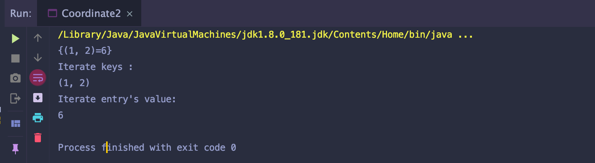

# 1. Map/Set/Hash

## Set

- A collection that can not contain duplicate elements.

- Java platform contains 3 general-purpose Set implementations:
  - **HashSet**: which stores its elements in a hashtable, is best-performing
  implementation; however, it makes no guarantees order of iteration
  - **TreeSet**: which stores its elements in a red-black tree(balanced binary search tree),
  order its elements based on their values.
  - **LinkedHashSet**: it is a HashSet and also it is a LinkedList, it maintains the order
  when each of the elments is inserted into the HashSet.

## Map

- A collection that maps keys to values. A Map cannot contain duplicate keys; each key
  can map to one value.
  - **A collection that stores<key, value> pairs, such that no duplicate keys are allowed**


- Java platform, contains 3 general-purpose Map implementations:
  - HashMap, TreeMap, and LinkedHashMap(LRU)

---

## HashMap

- [Common API](https://docs.oracle.com/javase/8/docs/api/java/util/HashMap.html)
  - V put(K key, V value)
  - V get(Object key)
  - V remove(Object key)
  - boolean containsKey(Object key)
  - boolean containsValue(Object value)  - O(n)
  - void clear()
  - int size()
  - boolean isEmpty()

---

## Time Complexity


---

## HashMap vs. Hashtable

- Similar to ArrayList vs. Vector

- Vector, Hashtable exist from Java 1.0
- ArrayList, HashMap introduced from Java 5
  1. Hashtable does not allow null key, but HashMap allows one null key.
  2. Vector and Hashtable operations are synchronized, introduce a lot of performance penalty

- **We don't use Hashtable anymore.**

- A HashMap implementaiton - I
  - A table of buckets(an array of buckets), using the array index to denote each bucket.
  - For each<key, value>, it goes to one of the buckets, the bucket index is determined by 
  a hash function applied one key and the size of array.


- **Collision Control**
  - Collision - two keys mapped to the same bucket
  - **Separate Chaining**(Close Addressing) - the element of each of the buckets is 
    actually a single linked list.
  - **Open addressing** - put the key-value pair into the "next" available bucket.
    - How to define next? Linear/quadratic/exponential probing, hash again
    - Challenge: handing removed keys in the map
    - Not used by Java, but by some real life systems.
  - If different keys are determined to use the same bucket, they will be chained in the list.


- What are the elements in the buckets? Singly Linked List, 
  each node contains one `<key, value>` pair

```java
class Entry<K, V>{
    K key;
    V value;
    Entry<K, V> next;
}
```

- [Interface Map.Entry<K,V>](https://docs.oracle.com/javase/8/docs/api/java/util/Map.Entry.html)


## HashMap Operations

- put(key, value)
  - int hash = hash(key)    -> hash
  - int index = hash % array_length     -> index
  - search for the list resides in the bucket to see if the key already exists
    1. if not find the same key already existed, add a new Entry node to the list
    2. if find an Entry with the same key, update the value of that Entry

- get(key)
  - int hash = hash(key)    -> hash
  - int index = hash % array_length     -> index
  - search for the list resides in the bucket to see if the key already exists


- **HashMap can only has one null key, it is always mapped to bucket 0**.

- Get into a little details about HashMap Implementation:
  - array of entries
  - each entry is actually a singly linked list (handle collision)
    - contains the <key, value> pair

1. Define the class for each entry:

```java
class Entry<K, V>{
    final K key;
    V value;
    Entry<K, V> next;
    Entry(K key, V value){
        this.key = key;
        this.value = value;
    }

    public K getKey(){
        return key;
    }

    public V getValue(){
        return value;
    }

    public void setValue(V value){
        this.value = value;
    }
}
```


2. maintain an array of entries
- `Entry<K,V>[] array`

- array[0]
  - To `get(K key)`, `put(K key, V value)`, `remove(K key)`, we follow the steps
    - hash(key) to hash#
    - hash# to entry index in the array
    - from the corresponding singly linked list, iterate all of the nodes to find if the 
      same key exists.

3. hash(key) to get the hash#

```java
private int hash(K key){
    //return the hash# of the key
    if(key == null){
        return 0;
    }
    int hashNumber = key.hashCode();
    //postprocessing to make the hashNumber non-negative.
}
```


4. from the hash#, mapped to the entry index.

```java
int getIndex(int hashNumber){
    //return the corresponding index of array.
    return hashNumber % array.length;
}
```

5. When iterate the corresponding entry for the given key, which is actually a singly linked 
   list, we need compare each of the entry in the list, if the **key is the same** 
   as the key we want.

```java
Entry<K, V> cur = array[index];
while(cur != null){
    K curKey = cur.getKey();
    if(curKey is the same as given key){
        //... ...
    }
    cur = cur.next;
}
```


## Two Questions Here:

1. "HashMap get(key), put(key, value), remove(key) is O(1)", Is it always true? 
   What is the major factor affecting the time complexity? `hash(key) -> key.hashCode()`
2. When traverse the linked list in that bucket to see if there is a same key already
   existed. how do we define "the same key"? `key.equals(anotherKey)`

## Very Important: HashMap use

- `key.hashCode()` to determine the entry index for the key
- `key.equals()` to determine whether two keys are the same keys.

- `==, equals(), hashCode()`
  - `==`
    - determine if two primitive types have have the same value.
    - **determine if two references are pointed to the same object**.
  - `equals(), hashCode()`
    - defined in `Object` class, Object is the root class for any java class
    - any Java class `implicitly extends` Object class, so if in the subclass these two
      methods are not overridden, it inherits what it defineds in Object class. 
    - the default implementation of equals() is check if the two references are pointed
      to the same object "=="
    - the default implementation of hashCode() returns a "unique hash value" for the object
      based on its memory address.

```java
class Object{
    public boolean equals(Object obj){
        return this == obj;
    }

    public int hashCode(){
        //here it returns the object's hash value(based on its memory address)
        //it is unique for each object.
    }

    public String toString(){

    }
}
```

- sometimes we don't want to compare the reference... **we want to compare the object's content**

- Example:(from an existing class)

```java
//s1 and s2 are different String objects
String s1 = "abc";
String s2 = new String("abc");

//this weill return false, "==" always compare if they are the same object.
s1 == s2

//this will return true, equals() for String class actually checks the "value"
s1.equals(s2);
```

- Why `s1.equals(s2) == true` ?
  - in String class, the `equals()` method is overridden:

```java
[a, b, c, d]
offset = 1
length 2
"bc"

[b, c]
offset = 0
length 2
"bc"
```

```java
public class String {
    char[] array;
    int offset;
    int length;

    @Override
    public boolean equals(Object obj){
        if(obj == this){
            return true;
        }
        if(!(obj instanceof String)){
            return false;
        }
        String another = (String)obj;
        //check each of the characters of the two String object if they are the same
        if(this.length != another.length){
            return false;
        }
        for (int i = 0; i < this.length; i++) {
            if(this.array[this.offset + i] != another.array[another.offset + i]){
                return false;
            }
        }
        //return true if they match
        return true;
    }
}
```

---

- Example(own class)

- class has to override `equals(), hashCode()` if you want to have a different meaning
  than comparing the reference.

```java
public class Coordinate {
    public int x;
    public int y;

    public Coordinate(int x, int y) {
        this.x = x;
        this.y = y;
    }

    //if in your own class, the equals() and hashCode() methods have not been
    //overridden, it will inherit the methods from Object class.
    public static void main(String[] args) {
        Coordinate one = new Coordinate(0, 0);
        Coordinate two = new Coordinate(0, 0);

        boolean flag = (one == two);
        System.out.println(flag);
    }
}
```


- try to override `equals()` method

```java
public class Coordinate {
    public int x;
    public int y;

    public Coordinate(int x, int y) {
        this.x = x;
        this.y = y;
    }

    @Override
    public boolean equals(Object obj){
        if (obj == this) {
            return true;
        }
        if (!(obj instanceof Coordinate)) {
            return false;
        }
        Coordinate another = (Coordinate) obj;
        return this.x == another.x && this.y == another.y;
    }

    //if in your own class, the equals() and hashCode() methods have not been
    //overridden, it will inherit the methods from Object class.
    public static void main(String[] args) {
        Coordinate one = new Coordinate(0, 0);
        Coordinate two = new Coordinate(0, 0);

        boolean flag = (one == two);
        System.out.println(flag);

        System.out.println(one.equals(two)); 
    }
}
```


---

## What about `hashCode()` ?

3. hash(key) to get the hash#

```java
private int hash(K key){
    //return the hash# of the key
    if(key == null){
        return 0;
    }
    int hashNumber = key.hashCode();
    //postprocessing to make the hashNumber non-negative.
}
```


4. from the hash#, mapped to the entry index.

```java
int getIndex(int hashNumber){
    //return the corresponding index of array.
    return hashNumber % array.length;
}
```

- Remember, in Hashmap, `key.hashCode()` method determines which entry the key will
  go to, we need to guarantee the same keys always go to the same entry.


- <u>In Java, There is a contract between `equals()` and `hashCode()`, the developers need
  to maintain:</u>
  - if `one.equals(two)`, it is a must that `one.hashCode() == two.hashCode()`
  - if `one.hashCode() == two.hashCode()`, it is not necessary `one.equals(two)` 
- **When you want to override `equals()`, please definitely override `hashCode()` as well**
  Only by doing this, you can make sure the HashMap will still work for the key type.


#### An example of override `equals()`, not override `hashCode()`

```java
public class Coordinate1 {
    public int x;
    public int y;

    public Coordinate1(int x, int y) {
        this.x = x;
        this.y = y;
    }

    @Override
    public boolean equals(Object obj){
        if (obj == this) {
            return true;
        }
        if (!(obj instanceof Coordinate1)) {
            return false;
        }
        Coordinate1 another = (Coordinate1) obj;
        return this.x == another.x && this.y == another.y;
    }

    @Override
    public String toString(){
        return "(" + x + ", " + y + ")";
    }

    public static void main(String[] args) {
        HashMap<Coordinate1, Integer> map = new HashMap<>();
        map.put(new Coordinate1(1, 2), 5);
        map.put(new Coordinate1(1, 2), 6);
        System.out.println(map);
        System.out.println("Iterate keys :");
        for (Coordinate1 key : map.keySet()) {
            System.out.println(key);
        }
        System.out.println("Iterate entry's value:");
        for(Map.Entry<Coordinate1, Integer> entry : map.entrySet()){
            System.out.println(entry.getValue());
        }
    }
}
```


#### An example of override `equals()`, override `hashCode()`

```java
public class Coordinate2 {
    public int x;
    public int y;

    public Coordinate2(int x, int y) {
        this.x = x;
        this.y = y;
    }

    @Override
    public boolean equals(Object obj){
        if (obj == this) {
            return true;
        }
        if (!(obj instanceof Coordinate2)) {
            return false;
        }
        Coordinate2 another = (Coordinate2) obj;
        return this.x == another.x && this.y == another.y;
    }

    @Override
    public int hashCode(){
        return x * 101 + y;
    }

    @Override
    public String toString(){
        return "(" + x + ", " + y + ")";
    }

    public static void main(String[] args) {
        HashMap<Coordinate2, Integer> map = new HashMap<>();
        map.put(new Coordinate2(1, 2), 5);
        map.put(new Coordinate2(1, 2), 6);
        System.out.println(map);
        System.out.println("Iterate keys :");
        for (Coordinate2 key : map.keySet()) {
            System.out.println(key);
        }
        System.out.println("Iterate entry's value:");
        for(Map.Entry<Coordinate2, Integer> entry : map.entrySet()){
            System.out.println(entry.getValue());
        }
    }
}
```



---

## `hashCode()` is VERY important!

1. The performance of HashMap soley depends on how good the `hashCode()` is.
   - bad `hashCode()` can lead to linear time complexity in extreme case, 
   - for example, if all the keys has the same hash number returned by `.hashCode()`
2. easy, fast, efficient
3. minimize collsion, as evenly distributed as possible 


## Common `hashCode()` implementation

```java
class Combo{
    int a;
    B b;
    C c;
    public Combo(int a, B b, C c){
        this.a = a;
        this.b = b;
        this.c = c;
    }

    @Override
    public int hashCode(){
        return a * 31 * 31 + b.hashCode() * 31 + c.hashCode();
    }
}

Combo c1 = new Combo(4, b1, c);
Combo c2 = new Combo(4, b2, c);
```

---


## Rehashing, load factor

- Rehashing
  - is needed when there are too many `<key, value>` pairs maintained in the
    hashmap, -> too many collsions.
  - **expand** the array to larger one and move all the <key, value> pairs to the new
    array (in HashMap by default, the array size is **doubled** each time.) 
  - **Rehashing is global wise - meaning all the <key, value> pairs need to participate.**

- load factor
  - to control when rehasing is needed, maintain the ratio of number of 
    <key, value> paris / number of buckets
  - default 0.75 (size/array.length)
  - when the ratio exceeds the limit, rehashing will happen.

---

## HashSet

- It is backed up by a HashMap instance. Only care about the Key here.

- [Common API](https://docs.oracle.com/javase/7/docs/api/java/util/HashSet.html)
  - `boolean add(E e)`
  - `boolean remove(Object o)`
  - `boolean contains(Object o)`
  - `void clear()`
  - `int size()`
  - `boolean isEmpty()`


```java
class HashSet<K>{
    private HashMap<K, Object> map;

    //special object used for all the existing keys
    private static final Object PRESENT = new Object();

    public HashSet(){
        map = new HashMap<K, Object>();       
    }
    public boolean contains(K key){
        return map.containsKey(key);
    }
    public boolean add(K key){
        return map.put(key, PRESENT) == null;
    }
    ...
}

Cell{
    int x;
    int y;
}

Set<String> set ...
"12,3"
"1,23"
set.add(x + "," + y);
```

