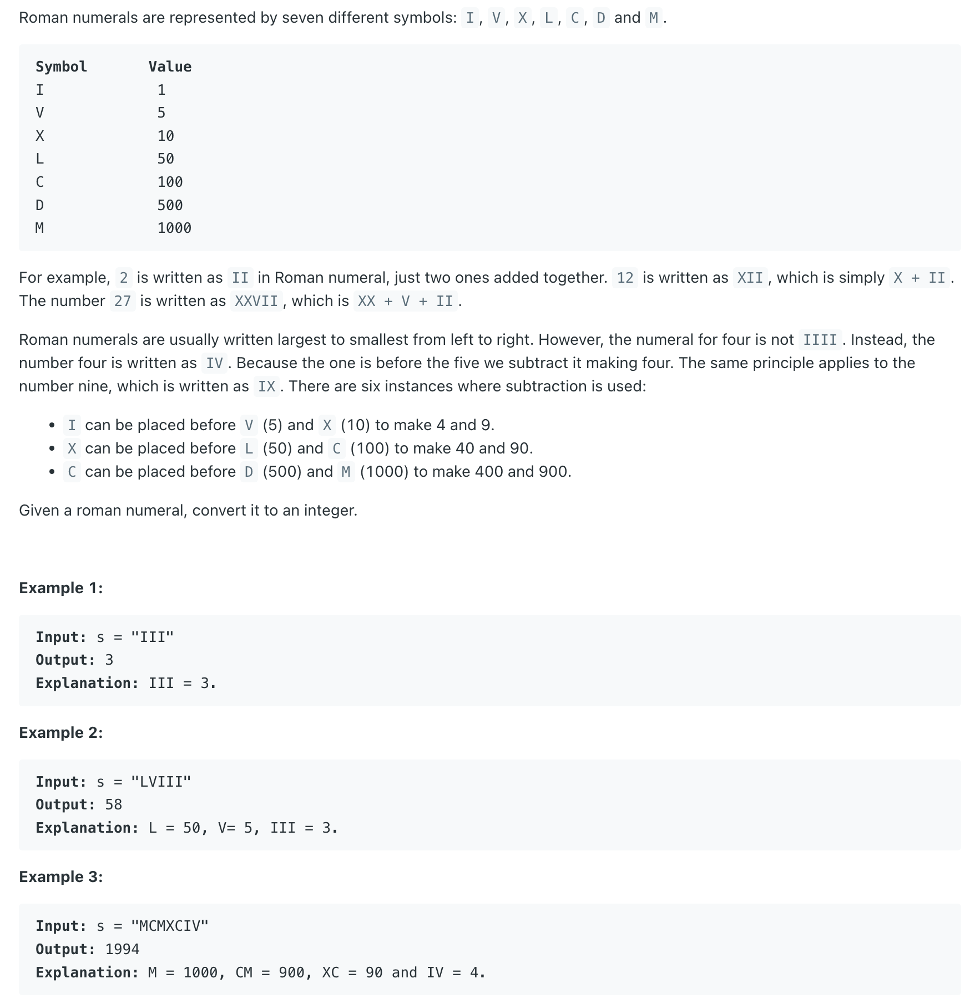

## 13. Roman to Integer



- **"IM" is invalid, "I" can only go before V and X, as stated in problem description.**
---

```ruby

    C M X C V I I I
    i                    since C < M
    res -= C =>  -100


    C M X C V I I I
      i
    res += M => -100 + 1000 => 900


    C M X C V I I I      since X < C
        i
    res += X => 900 - 10 => 890


    C M X C V I I I      
          i
    res += X => 890 + 100 => 990


    C M X C V I I I      
            i
    res += X => 990 + 5 => 995


    C M X C V I I I      repeated add I three times
                  i
    res += X => 995 + 3 => 998
```

---
```java
class _13_RomanToInteger {
    public int romanToInt(String s) {
        // Mapping of Roman numerals to their integer values
        Map<Character, Integer> roman = new HashMap<>();
        roman.put('I', 1);
        roman.put('V', 5);
        roman.put('X', 10);
        roman.put('L', 50);
        roman.put('C', 100);
        roman.put('D', 500);
        roman.put('M', 1000);

        int res = 0;

        // Iterate through the string
        for (int i = 0; i < s.length(); i++) {
            // If the current character's value is smaller than the next one, subtract it
            if (i + 1 < s.length() && roman.get(s.charAt(i)) < roman.get(s.charAt(i + 1))) {
                res -= roman.get(s.charAt(i));
            } else {
                // Otherwise, add it
                res += roman.get(s.charAt(i));
            }
        }

        return res;
    }
}
```

---
#### Python

```py
class Solution:
    def romanToInt(self, s: str) -> int:
        # largest to smallest: add them up
        # smaller before larger: substract smaller
        roman = {"I": 1, "V": 5, "X": 10, "L": 50, "C": 100, "D": 500, "M": 1000}
        res = 0

        for i in range(len(s)):
            if i + 1 < len(s) and roman[s[i]] < roman[s[i + 1]]:
                res -= roman[s[i]]
            else:
                res += roman[s[i]]

        return res
```
