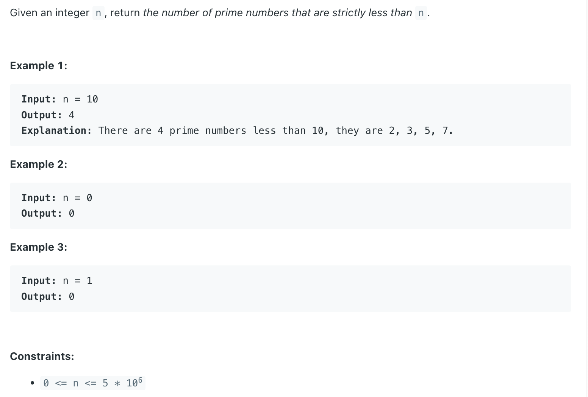
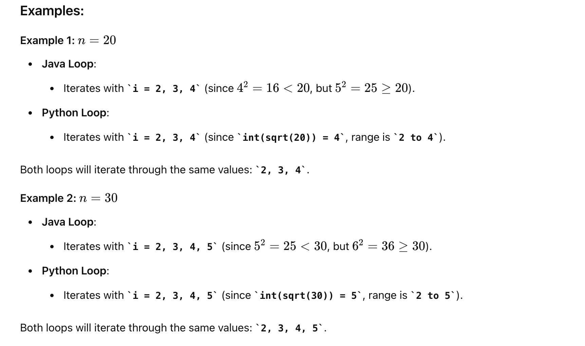

## 204. Count Primes

---

- Step 1: Initialize the **isPrime** array
  - Suppose we want to find all prime numbers less than 20. We create a boolean array **isPrime** of size `20`, 
    where `isPrime[i]` represents whether **i** is **prime** or not. Initially, we assume all numbers are prime, 
    so we set all values to true.

```ruby
isPrime array: 
[true, true, true, true, true, true, true, true, true, true, true, true, true, true, true, true, true, true, true, true]
```


- Step 2: Iterate from **2** to sqrt(n)
  - We start from the first prime number, **2**. We know that **all multiples of 2 are not prime**, so we mark them as false.


```ruby
isPrime array: 
[true, true, true, false, true, false, true, false, true, false, true, false, true, false, true, false, true, false, true, false]

Next, we move to the next prime number, 3. We mark all multiples of 3 as false.

isPrime array: 
[true, true, true, false, true, false, true, false, false, false, true, false, true, false, true, false, true, false, true, false]

We repeat this process for all numbers up to the square root of 20 (approximately 4.47), which is 4.
```


- Step 3: Count the remaining prime numbers

---


```java
class _204_Count_Primes {
    public int countPrimes(int n) {
        // Step 1: Initialize the isPrime array
        boolean[] isPrime = new boolean[n];
        Arrays.fill(isPrime, true);

        // step 2: Iterate from 2 to sqrt(n)
        for (int i = 2; i * i < n; i++) {
            if (isPrime[i]) {
                // Mark multiples of i as non-prime
                for (int j = i * i; j < n; j += i) {
                    isPrime[j] = false;
                }
            }
        }

        // Step 3: Count the remaining prime numbers
        int count = 0;
        for (int i = 2; i < n; i++) {
            if (isPrime[i]) {
                count++;
            }
        }
        return count;
    }
}
```
---

#### Java vs Python




#### Python

```py
class Solution:
    def countPrimes(self, n: int) -> int:
        # Step 1: Initialize the isPrime array
        isPrime = [True] * n

        # Step 2: Iterate from 2 to sqrt(n)
        for i in range(2, int(n ** 0.5) + 1):
            if isPrime[i]:
                # Mark multiples of i as non-prime
                for j in range(i * i, n, i): # j takes on the values i * i, i * i + i, i * i + 2 * i, ..., n in each iteration.
                    isPrime[j] = False

        # Step 3: Count the remaining prime numbers
        count = 0
        for i in range(2, n):
            if isPrime[i]:
                count += 1
        return count
```