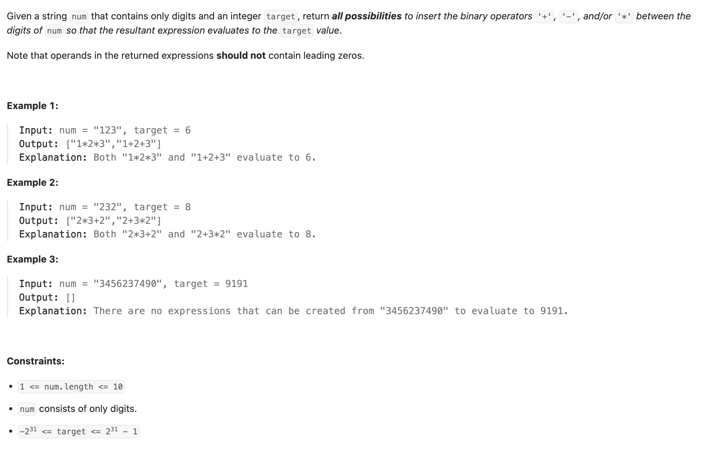
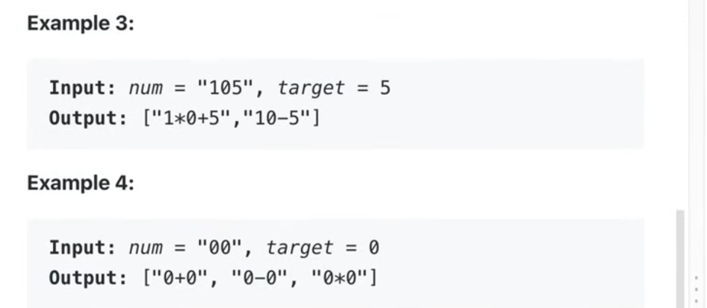

## 282. Expression Add Operators



---
- 1. It **doesn't mean** that there must be an operator between any two digits.
  - you're allowed to concatenate digits to form **multi-digit numbers** — for example, '1' and '2' can form '12' **without needing** an 
    operator in between.


---
```java
class _282_Expression_Add_Operators {
    List<String> results = new ArrayList<>(); // 'ans' -> 'results'
    String numStr;                            // 's' -> 'numStr'
    int len;                                  // 'n' -> 'len'
    int targetVal;                            // 'target' -> 'targetVal'

    public List<String> addOperators(String num, int target) {
        this.numStr = num;
        this.len = numStr.length();
        this.targetVal = target;

        // Initial DFS call:
        // idx: current parsing index in numStr
        // prevVal: value of the last operand (for multiplication adjustments)
        // currSum: current running total of the expression
        // expr: string representation of the expression built so far
        backtrack(0, 0, 0, "");

        return results;
    }

    private void backtrack(int idx, long prevVal, long currSum, String expr) {
        // Base Case: All digits processed
        if (idx == len && currSum == targetVal) {
            results.add(expr);
            return;
        }
        if (idx == len) {
            return;
        }

        // Iterate to form numbers of varying lengths starting from idx
        for (int i = idx; i < len; i++) {
            // Pruning: Handle leading zeros for multi-digit numbers (e.g., "05" is invalid)
            if (i > idx && numStr.charAt(idx) == '0') {
                break;
            }

            // Parse the number from the current segment numStr[idx...i]
            long currentNum = Long.parseLong(numStr.substring(idx, i + 1));

            // Special handling for the very first number (no preceding operator)
            if (idx == 0) {
                backtrack(i + 1, currentNum, currentNum, "" + currentNum);
            } else {
                // For subsequent numbers, try adding operators (+, -, *)

                // Option 1: Addition (+)
                backtrack(i + 1, currentNum, currSum + currentNum, expr + "+" + currentNum);

                // Option 2: Subtraction (-)
                backtrack(i + 1, -currentNum, currSum - currentNum, expr + "-" + currentNum);

                // Option 3: Multiplication (*) - Handles precedence
                // Calculate the product to add
                long prod = prevVal * currentNum;
                // 'Undo' the previous operation's effect (currSum - prevVal) and add the new product
                backtrack(i + 1, prod, currSum - prevVal + prod, expr + "*" + currentNum);
            }
        }
    }
}
```
---


