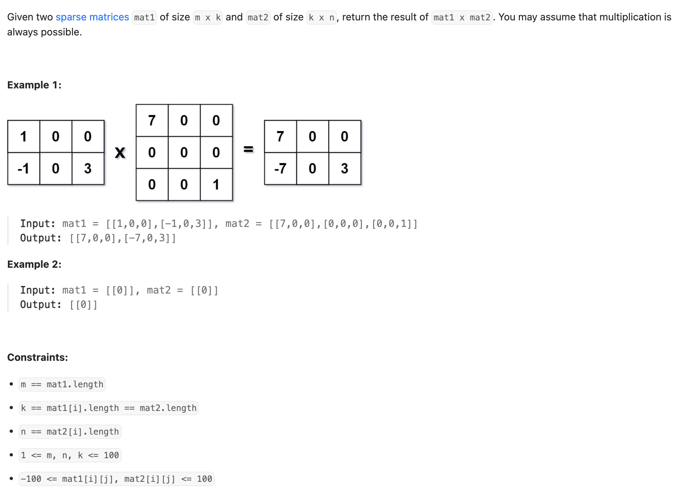
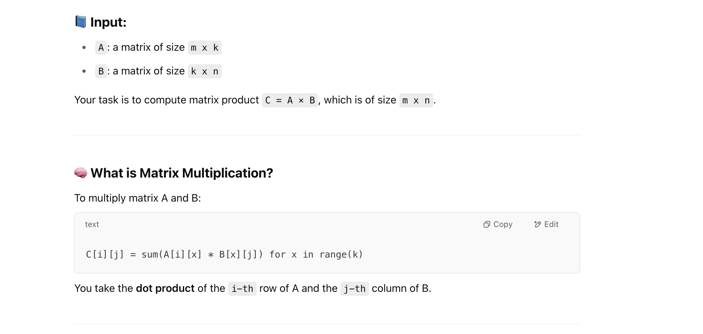

## 311. Sparse Matrix Multiplication

---



```java
class Solution {
    public int[][] multiply(int[][] A, int[][] B) {
        int m = A.length, k = A[0].length, n = B[0].length;
        int[][] result = new int[m][n];

        // For each row in A
        for (int i = 0; i < m; i++) {
            // For each non-zero element in row A[i]
            for (int x = 0; x < k; x++) {
                if (A[i][x] != 0) {
                    // For each column in B
                    for (int j = 0; j < n; j++) {
                        if (B[x][j] != 0) {
                            result[i][j] += A[i][x] * B[x][j];
                        }
                    }
                }
            }
        }
        return result;
    }
}
```