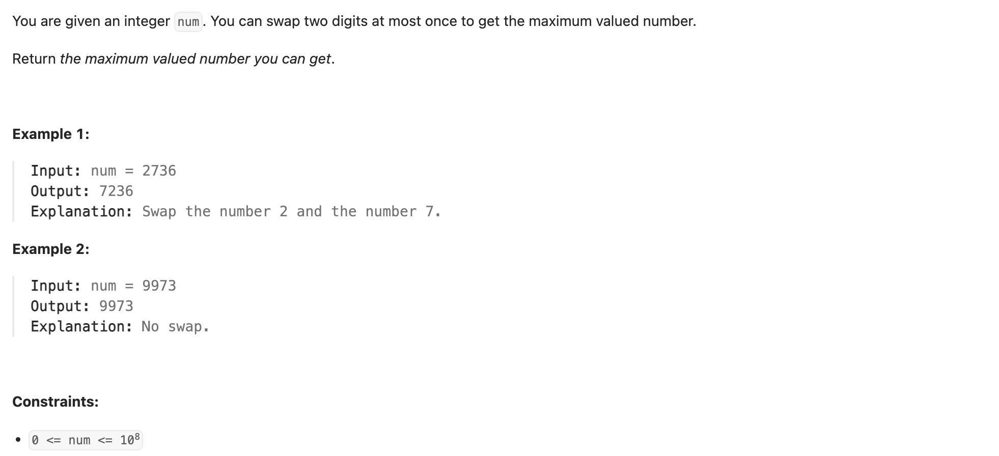
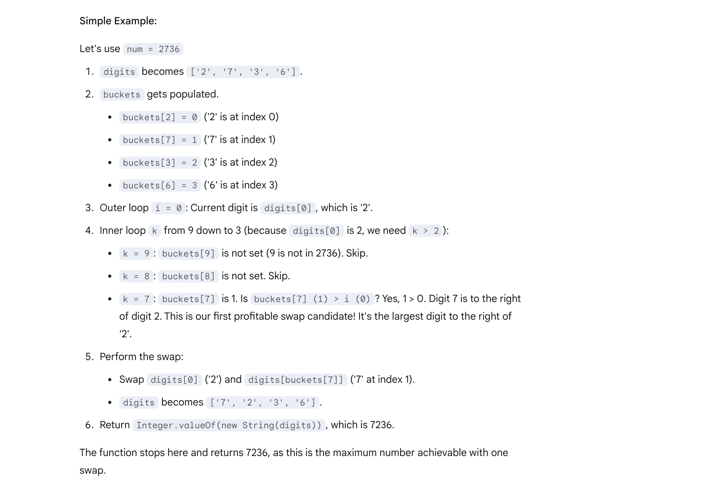

## 670. Maximum Swap

---



```java
class _670_Maximum_Swap {
    public int maximumSwap(int num) {
        char[] digits = Integer.toString(num).toCharArray();

        int[] buckets = new int[10];
        for (int i = 0; i < digits.length; i++) {
            buckets[digits[i] - '0'] = i;
        }

        for (int i = 0; i < digits.length; i++) {
            for (int k = 9; k > digits[i] - '0'; k--) {
                if (buckets[k] > i) {
                    char tmp = digits[i];
                    digits[i] = digits[buckets[k]];
                    digits[buckets[k]] = tmp;
                    return Integer.valueOf(new String(digits));
                }
            }
        }
        return num;
    }
}
```