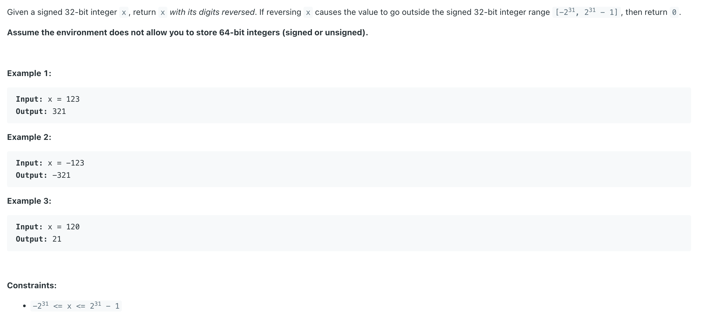
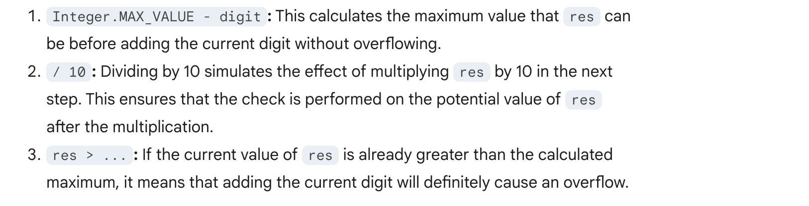

## 7. Reverse Integer

---

- for **Assume the environment does not allow you to store 64-bit integers (signed or unsigned).**
- you cannot use data types like long or unsigned long in Java. This includes implicitly converting to a double type, 
  as it is a 64-bit floating-point type.

---



---

```java
class reverseInteger_NotUsing_64_bits {
    public int reverse(int x) {
        boolean isNegative = false;
        if (x < 0) {
            isNegative = true;
            x = -x;
        }

        int reversed = 0;
        while (x > 0) {
            int digit = x % 10;
            x /= 10;
            if (reversed > (Integer.MAX_VALUE - digit) / 10) {
                return 0;
            }
            reversed = (reversed * 10) + digit;
        }
        return isNegative ? -reversed : reversed;
    }
}
```
---

#### Python

```py
class Solution:
    def reverse(self, x: int) -> int:
        is_negative = False
        if x < 0:
            is_negative = True
            x = -x
        
        res = 0
        while x > 0:
            digit = x % 10
            x //= 10
            if res > (2**31 - 1 - digit) // 10:
                return 0
            res = (res * 10) + digit
        
        return -res if is_negative else res
        
```