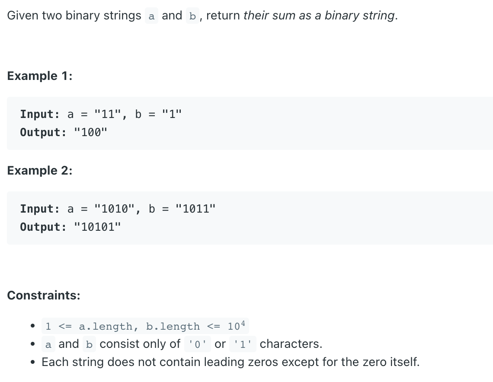
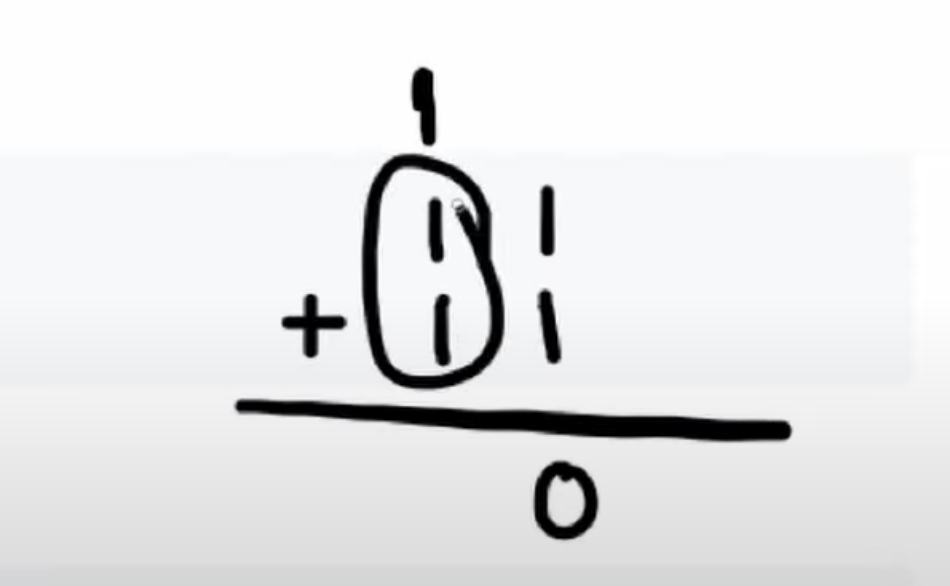

## 67. Add Binary


```ruby

        1  1
   +       1
---------------
     1  0  0


        1  1
   +    1  1
---------------
     1  1  0
```


---

```java
class _67_AddBinary {
    public String addBinary(String a, String b) {
        StringBuilder sb = new StringBuilder();
        int i = a.length() - 1, j = b.length() - 1;
        int carry = 0;
        while (i >= 0 || j >= 0) {
            int sum = carry;
            if (j >= 0) {
                sum += b.charAt(j) - '0';
                j--;
            }
            if (i >= 0) {
                sum += a.charAt(i) - '0';
                i--;
            }
//            sb.append(sum % 2);
            sb.insert(0, sum % 2);
            carry = sum / 2;
        }
        if (carry != 0) {
            sb.insert(0, carry);
        }
        return sb.toString();
    }

    public static void main(String[] args) {
        _67_AddBinary addBinary = new _67_AddBinary();
        String res = addBinary.addBinary("1010", "1011");
        System.out.println(res); // "10101"
    }
}
```