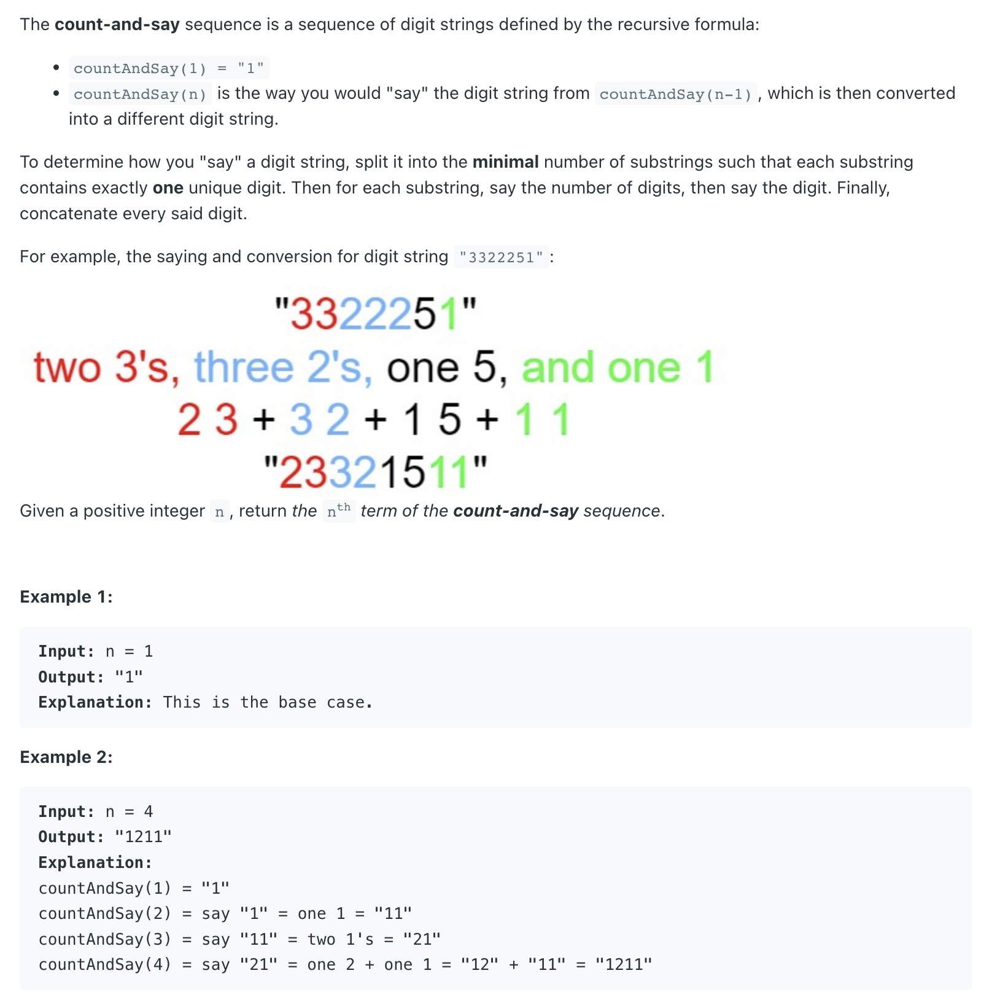
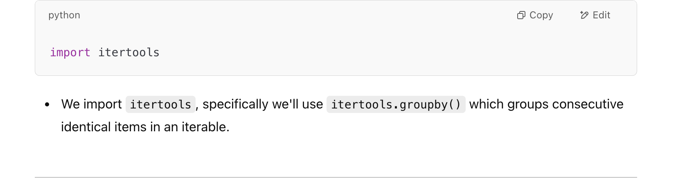
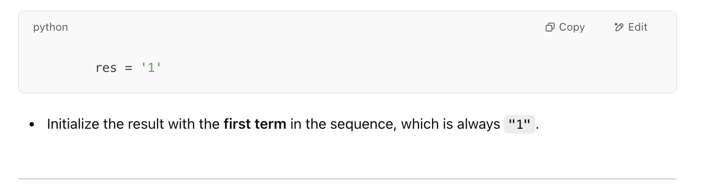
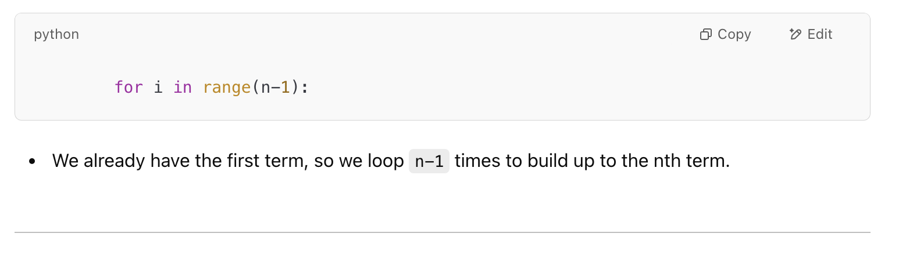
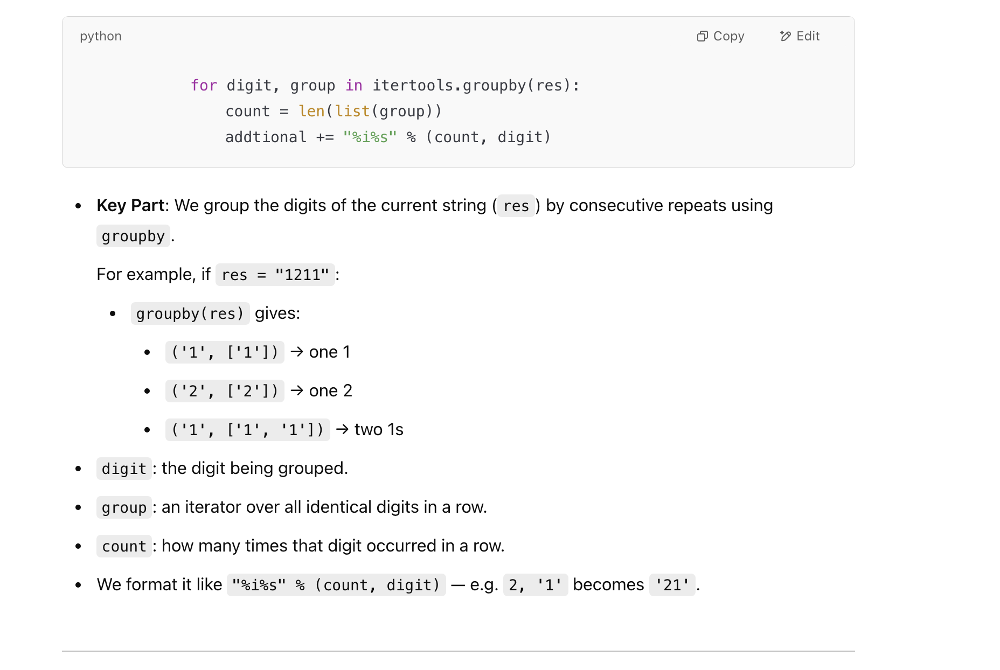
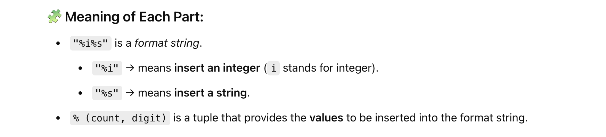

## 38. Count and Say

---
```ruby
1.     1
2.     11
3.     21
4.     1211
5.     111221 
6.     312211
7.     13112221
8.     1113213211
9.     31131211131221
10.   13211311123113112211


countAndSay(1) => 1
countAndSay(2) 对应上一行， One 1 => 11
countAndSay(3) 对应上一行， two 1 => 21
countAndSay(4) 对应上一行， One 2, One 1 => 1211
countAndSay(5) 对应上一行， One 1, One 2, Two 1s => 111221
countAndSay(6) 对应上一行， Three 1, Two 2, One 1 => 312211 
countAndSay(7) 对应上一行， One 3, One 1, Two 2, Two 1 => 13112221 

第二步，和第一步有关系
第三步，和第二步有关系
第四步，和第三步有关系
etc..
```

---
### import Itertools library











```py
class Solution:
    def countAndSay(self, n: int) -> str:
        res = '1'
        for i in range(n-1):
            addtional = ''
            for digit, group in itertools.groupby(res):
                count = len(list(group))
                # addtional += "%i%s" % (count, digit)
                addtional += f"{count}{digit}"
            res = addtional
        return res
```

---
```java
class Solution {
    public String countAndSay(int n) {
        String prev = "1";
        for (int i = 1; i < n; i++) {
            StringBuilder cur = new StringBuilder();
            for (int j = 1, count = 1; j <= prev.length(); j++) {
                if (j == prev.length() || prev.charAt(j - 1) != prev.charAt(j)) {
                    cur.append(count);
                    cur.append(prev.charAt(j - 1));
                    count = 1;
                } else {
                    count++;
                }
            }
            prev = cur.toString();
        }
        return prev;
    }
}
```
