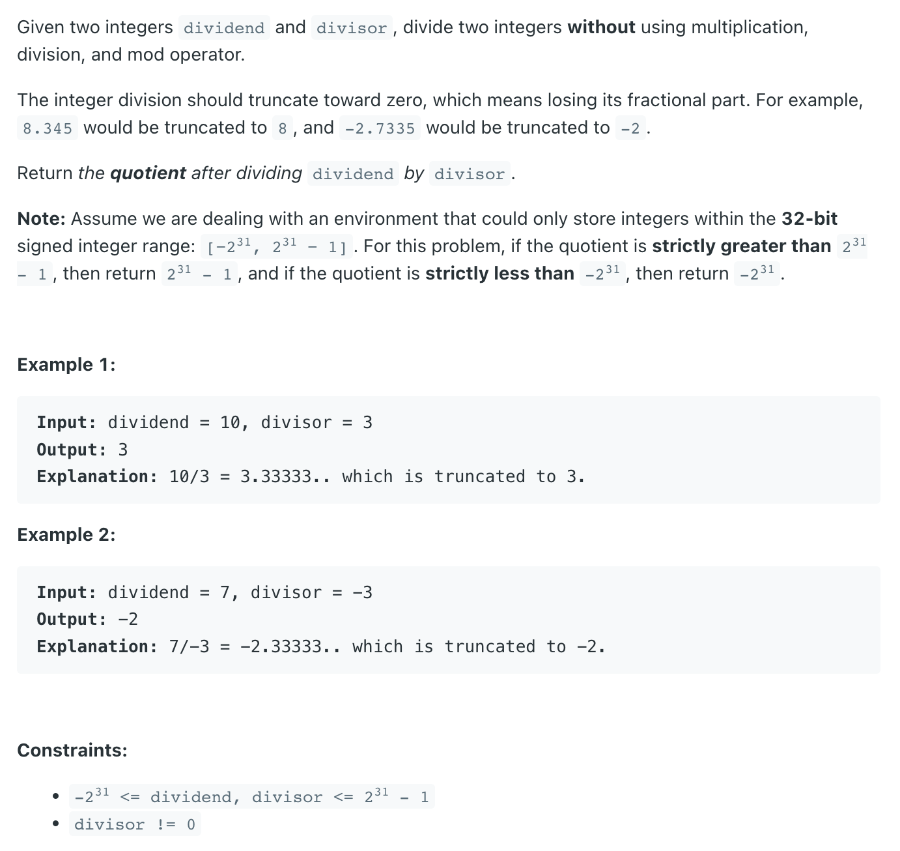
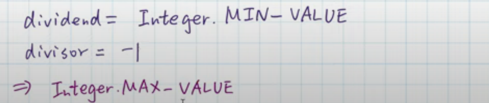

## 29. Divide Two Integers

---
- [youtube video](https://www.youtube.com/watch?v=S9huMzNzR4M)


- `7 / 3` => `3 * 2^1` 
- `10 / 3` ==> `3 * 2^1` + `3 * 2^0` = `3 * (2^1 + 2^0)`




```java
class _29_DivideTwoIntegers {
    public int divide(int dividend, int divisor) {
        if (dividend == Integer.MIN_VALUE && divisor == -1) {
            return Integer.MAX_VALUE;
        }
        boolean isNegative = (dividend > 0 && divisor < 0)
                || (dividend < 0 && divisor > 0);

        int res = 0;
        long a = Math.abs((long) dividend); // convert from int type to Long type
        long b = Math.abs((long) divisor);
        int shift = 31;

        while (a >= b) {
            while (a < (b << shift)) {
                // 如果 left shift 31 太多了，那就 left shift 30, 29 ...
                shift--;
            }
            // 这时候, a > (b << shift)
            a -= (b << shift);
            res += (1 << shift);
        }

        return isNegative ? -res : res;
    }

    public static void main(String[] args) {
        _29_DivideTwoIntegers divideTwoIntegers = new _29_DivideTwoIntegers();
        int res = divideTwoIntegers.divide(10, 3);
        System.out.println(res); // 3
        res = divideTwoIntegers.divide(7, -3);
        System.out.println(res); // -2
    }
}
```