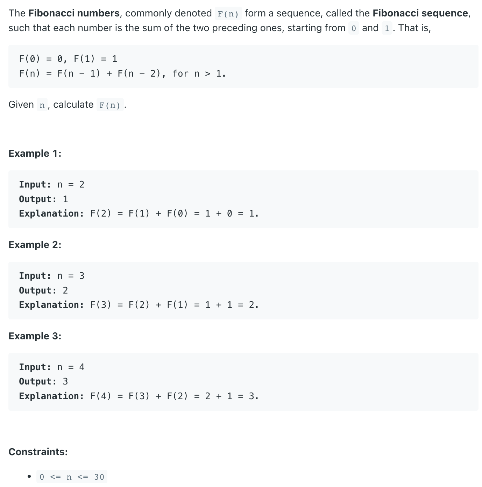

## 509. Fibonacci Number


```java
class Solution {
    public int fib(int n) {
        if (n == 0) {
            return 0;
        } else if (n == 1) {
            return 1;
        }
        
        return fib(n - 1) + fib(n - 2);
    }
}
```