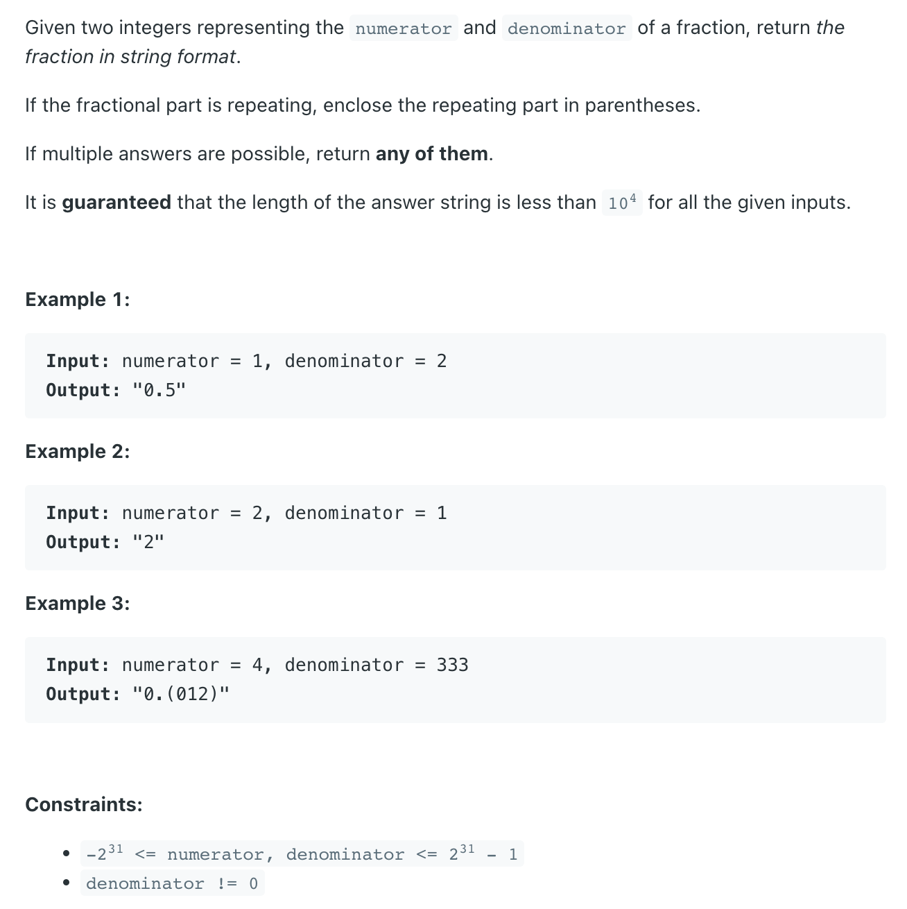

## 166. Fraction to Recurring Decimal

---

- [leetcode](https://leetcode.com/problems/fraction-to-recurring-decimal/discuss/51106/My-clean-Java-solution)
- [中文教程](https://www.youtube.com/watch?v=WJMrceU-ujs)
---

```java
class _166_FractionToRecurringDecimal {
    public String fractionToDecimal(int numerator, int denominator) {
        if (numerator == 0) return "0";

        StringBuilder sb = new StringBuilder();
        // sb.append(((numerator > 0) ^ (denominator > 0)) ? "-" : "");
        if (numerator > 0 && denominator < 0 || numerator < 0 && denominator > 0) {
            sb.append("-");
        }

        long divisor = Math.abs((long) numerator);
        long dividend = Math.abs((long) denominator);

        sb.append(divisor / dividend);
        long remainder = divisor % dividend;
        if (remainder == 0) {
            return sb.toString();
        }

        sb.append(".");
        Map<Long, Integer> map = new HashMap<>();
        map.put(remainder, sb.length());
        while (remainder != 0) {

            remainder *= 10;
            sb.append(remainder / dividend);
            remainder %= dividend;

            if (map.containsKey(remainder)) {
                // 这里表示remainder 开始重复了(比如: 4 / 333): 012 012 012
                sb.insert(map.get(remainder), "(");
                sb.append(")");
                break;
            } else {
                map.put(remainder, sb.length());
            }


        }
        return sb.toString();
    }

    public static void main(String[] args) {
        _166_FractionToRecurringDecimal ftrd = new _166_FractionToRecurringDecimal();
        String res = ftrd.fractionToDecimal(4, 333);
        System.out.println(res); // "0.012"
    }
}

```
