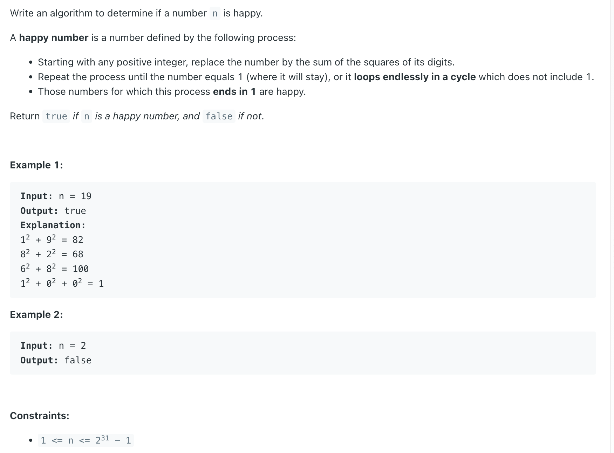
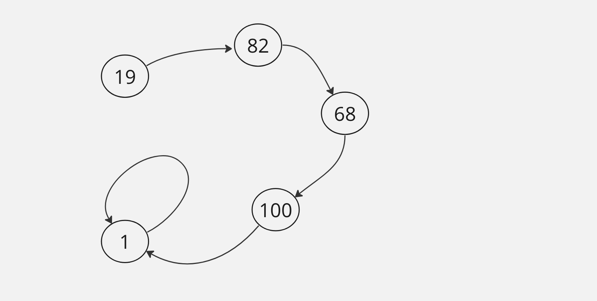
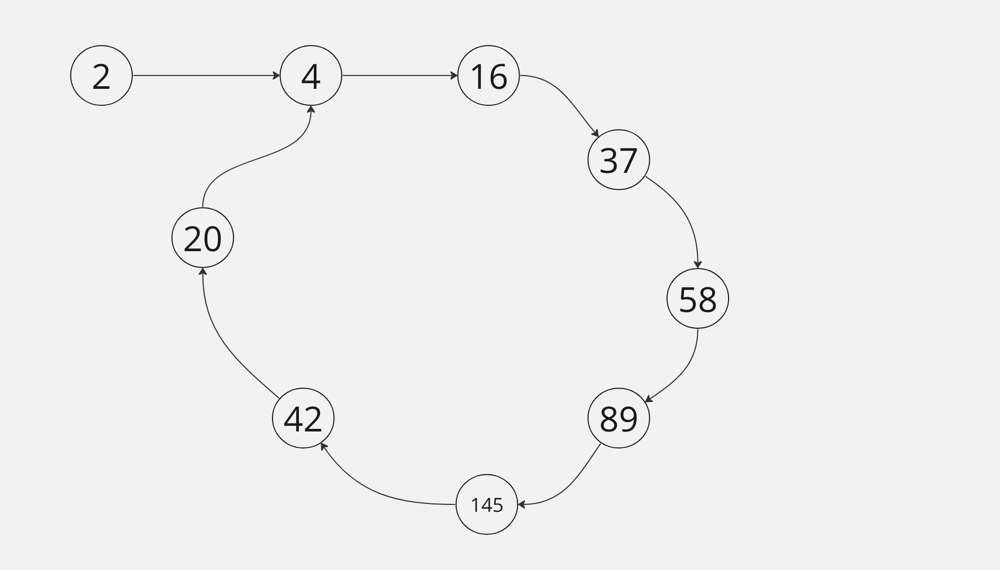

## 202. Happy Number

---

- `Input: n = 19`



- `1` is going to loop infinitely, so `19` is a happy number.

---

- let's look at a different example:

- `Input: n = 2`



- this is **not** a happy number

```java
class _202_HappyNumber {
    public boolean isHappy(int n) {
        Set<Integer> set = new HashSet<>();

        while (!set.contains(n)) {
            set.add(n);
            n = sumOfSquares(n);

            if (n == 1) {
                return true;
            }
        }
        return false;
    }

    private int sumOfSquares(int n) {
        // TODO: 19 -> 1^2 + 9^2 = 82
        // 19 % 10 = 9
        // 19 / 10 = 1
        // 1 % 10 = 0
        // 1 / 10 = 0

        int sum = 0;
        while (n > 0) {
            int digit = n % 10;
            digit = digit * digit;
            sum += digit;
            n /= 10;
        }
        return sum;
    }
}
```

---

