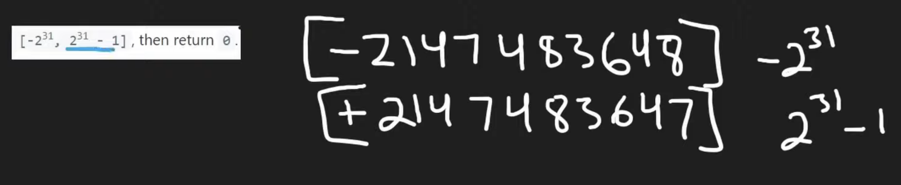

## Introduction

- [How to reverse Integer](https://novemberfall.github.io/LeetCode-NoteBook/#/most/ri)
  - `123` % `10` = `3`,   `123` / `10` = `12`
  - `12` % `10` = `2`
  - `3` * `10` = `30` + `2` = `32`      

- 32 bits

