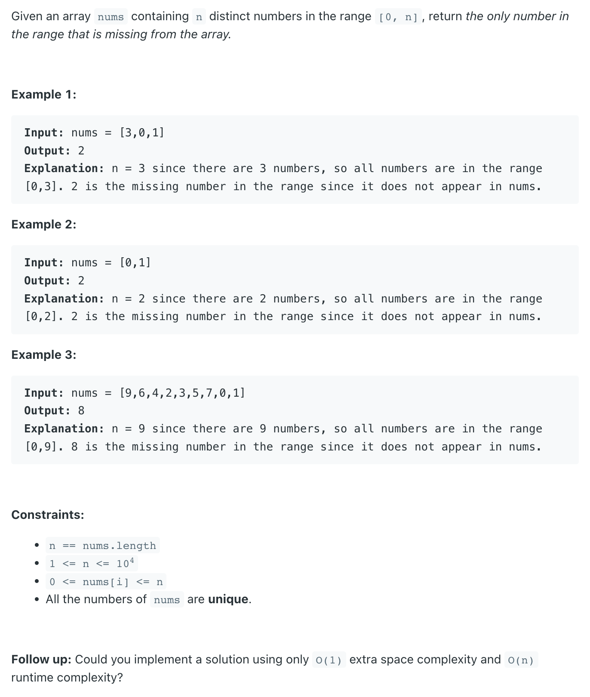

## 268. Missing Number


- [reference](https://novemberfall.github.io/LeetCode-NoteBook/#/math/addbin)
---
```py
class Solution:
    def missingNumber(self, nums: List[int]) -> int:
        n = len(nums)
        arr = set(nums)
        for missing in range(0, n + 1):
            if missing not in arr:
                return missing
        return -1
```


---

```ruby
    XOR - (a ^ b ^ a) = b
    XOR - (5 ^ 3 ^ 5) = 3

because: 
        1 0 1
XOR     1 0 1 
----------------
        0 0 0 
        
    
    XOR - (0 ^ 3) = 3

        0 0 0
XOR     0 1 1 
----------------
        0 1 1 
        

So:

        [0, 1, 2, 3]
XOR     [0, 1,    3]
---------------------
        [0, 0, 2, 0]
```
---

```java
/**

 Assume: [0, 1, 3, 4]
                        xorNum = 4
         [0, 1, 2, 3, 4]
 XOR     [0, 1, 3,    4]
 ------------------------
                   3

 */
class _268_MissingNumber {
    public int missingNumber(int[] nums) {
        int n = nums.length;
        int xor = n;
        for (int i = 0; i < n; i++) {
            xor = xor ^ i ^ nums[i];
            // a ^ b ^ a = b
        }
        return xor;
    }

    public static void main(String[] args) {
        _268_MissingNumber missingNumber = new _268_MissingNumber();
        int xor = missingNumber.missingNumber(new int[]{0, 1, 3, 4});
        System.out.println(xor); // 2
    }
}
```
