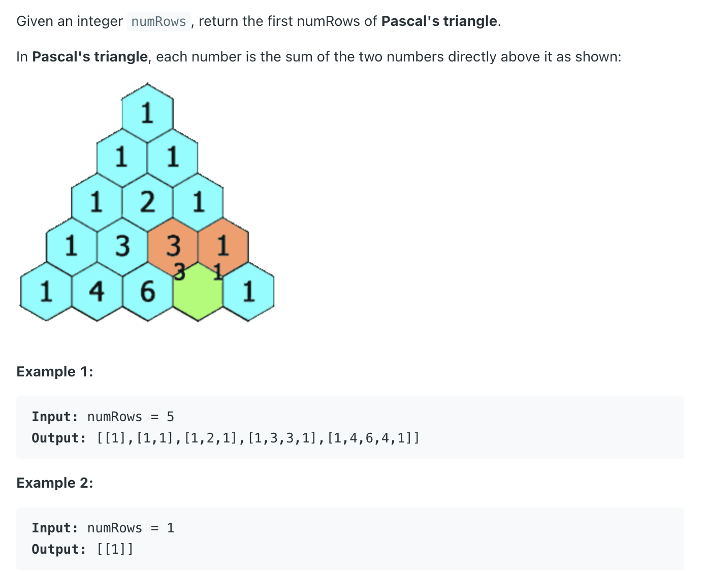
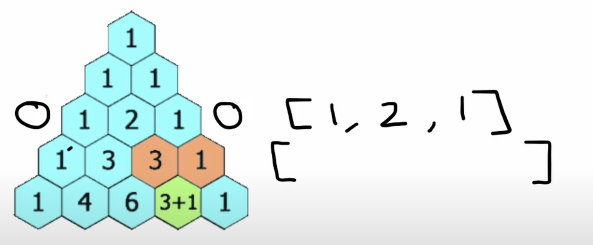
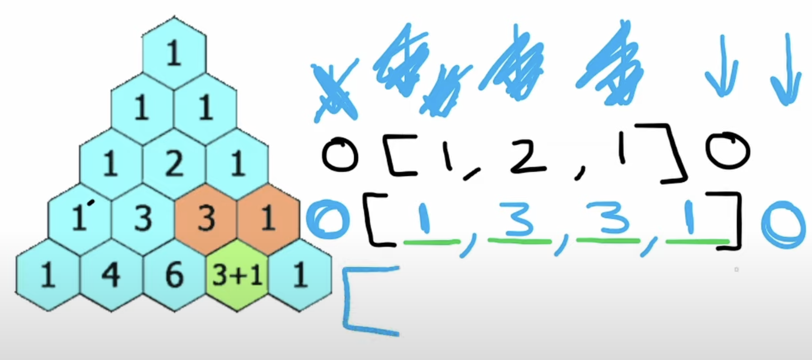

## 118. Pascal's Triangle

---
- [中文](https://youtube.com/watch?v=QpLdVwe1hvs)
---
```java
class Solution {
    public List<List<Integer>> generate(int numRows) {
        List<List<Integer>> res = new ArrayList<>();
        List<Integer> row = new ArrayList<>();
        for (int i = 0; i < numRows; i++) {
            row.add(0, 1);
            for (int j = 1; j < row.size() - 1; j++) {
                row.set(j, row.get(j) + row.get(j + 1));
            }
            res.add(new ArrayList<>(row));
        }
        return res;
    }
}

```
---


### python

---



- we can assume `arr[startIndex - 1] = 0`, and `arr[endIndex + 1] = 0`




```py
class Solution:
    def generate(self, numRows: int) -> List[List[int]]:
        res = [[1]]

        for i in range(numRows - 1):
            temp = [0] + res[-1] + [0]
            row = []
            for j in range(len(res[-1]) + 1):
                row.append(temp[j] + temp[j + 1])
            res.append(row)
        return res


# Main method to test with numRows = 5
if __name__ == "__main__":
    solution = Solution()
    result = solution.generate(5)

    # Print the resulting Pascal's Triangle
    for row in result:
        print(row)
```