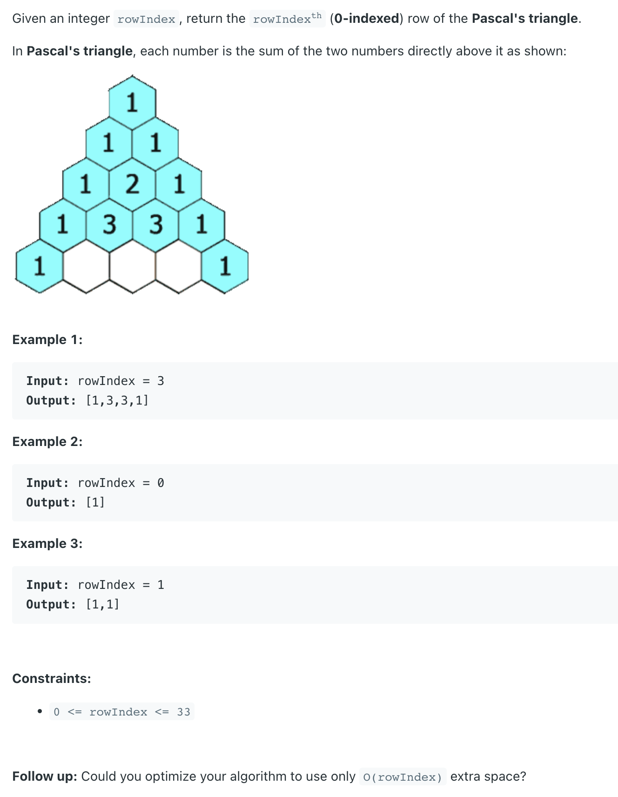

## 119. Pascal's Triangle II

---

- [refer to LC 118](https://novemberfall.github.io/LeetCode-NoteBook/#/most/pascal)

- 本体破题点： **就是对照题目的动图，然后compare 自己的codes, 猜想一下 就会发现规律**


```java
class _119_PascalTriangle_II {
    public List<Integer> getRow(int rowIndex) {
        List<Integer> row = new ArrayList<>();
        for (int i = 0; i <= rowIndex; i++) {
            row.add(0, 1);
            for (int j = 1; j < row.size() - 1; j++) {
                row.set(j, row.get(j) + row.get(j + 1));
            }
        }
        return row;
    }
}
```