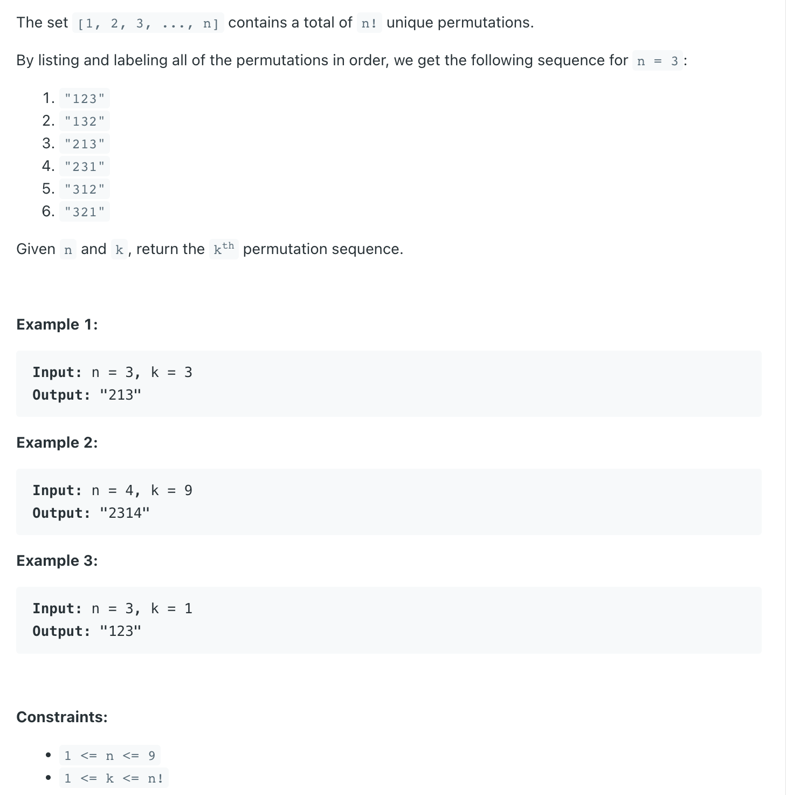
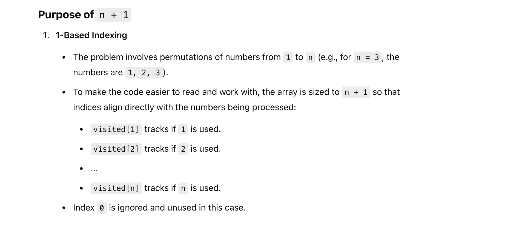
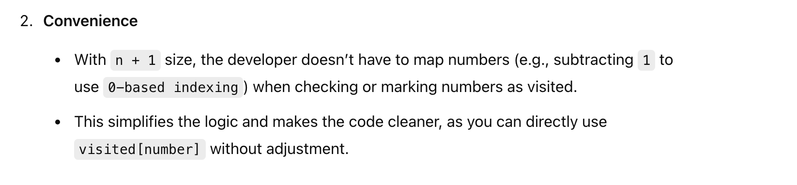
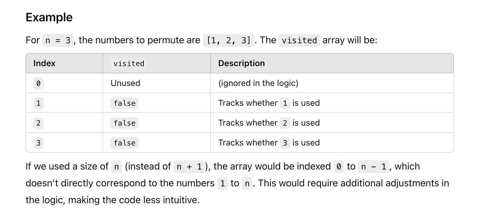

## 60. Permutation Sequence

---

### Brute Force

```java
class permutationSequence_bruteForce {
    private int count = 0;
    private String res  = "";

    public String getPermutation(int n, int k) {
        boolean[] visited = new boolean[n + 1];

        dfs(n, k, visited, new StringBuilder());
        return res;
    }

    private void dfs(int n, int k, boolean[] visited, StringBuilder sb) {
        if (res.length() != 0) {
            return;
        }
        
        if (sb.length() == n) {
            count++;
            if (count == k) {
                res = sb.toString();
            }
            return;
        }

        for (int i = 1; i <= n; i++) {
            if (visited[i]) {
                continue;
            }

            visited[i] = true;
            sb.append(i);
            dfs(n, k, visited, sb);
            sb.setLength(sb.length() - 1);
            visited[i] = false;
        }
    }

    public static void main(String[] args) {
        permutationSequence_bruteForce psbf = new permutationSequence_bruteForce();
        String res = psbf.getPermutation(3, 3);
        System.out.println(res);// 213

        permutationSequence_bruteForce psbf2 = new permutationSequence_bruteForce();
        String res2 = psbf2.getPermutation(4, 9);
        System.out.println(res2);// 2314
    }
}
```
---

- [可以先阅读这个video](https://www.youtube.com/watch?v=W9SIlE2jhBQ)

---


## why did it set `n + 1`, wht is the purpose?   







---

#### Python

```py
class Solution:
    def __init__(self):
        self.count = 0
        self.res = ""

    def getPermutation(self, n: int, k: int) -> str:
        visited = [False] * (n + 1)
        self.dfs(n, k, visited, [])
        return self.res

    def dfs(self, n: int, k: int, visited: list, path: list):
        if self.res:
            return
        
        if len(path) == n:
            self.count += 1
            if self.count == k:
                self.res = ''.join(map(str, path))
            return
        
        for i in range(1, n + 1):
            if visited[i]:
                continue    
            
            visited[i] = True
            path.append(i)
            self.dfs(n, k, visited, path)
            path.pop()
            visited[i] = False
        
```