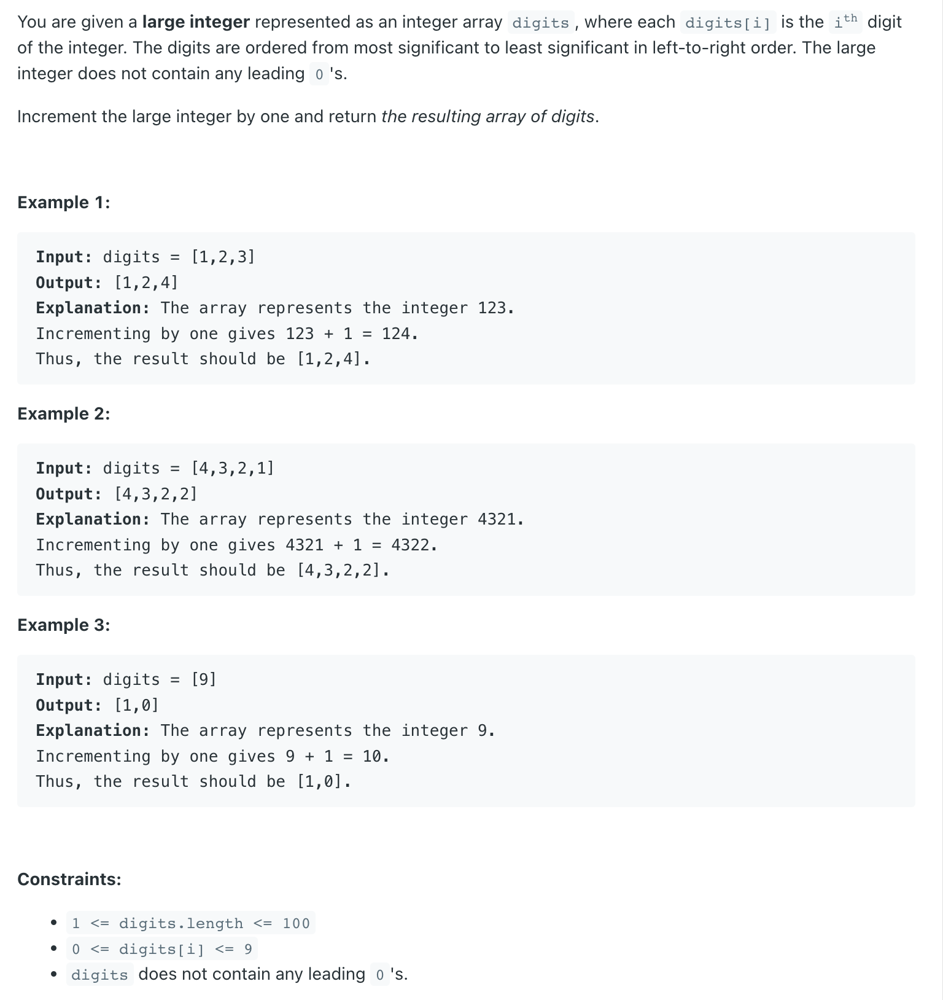

## 66. Plus One


- [leetCode discuss](https://leetcode.com/problems/plus-one/discuss/2706861/JAVA-Fastest-greater-0ms-Runtime-easy-and-elegant-Solution)
---
```java
class _66_PlusOne {
    public int[] plusOne(int[] digits) {
        for (int i = digits.length - 1; i >= 0; i--) {
            if (digits[i] < 9) {
                digits[i]++;
                return digits;
                /*
                 starting from extreme right--> if array[i] is less than 9 means can be added with 1
                 i.e. [ 5,8 ]-->[ 5,9 ] or
                      [ 9,4 ]-->[ 9,5 ] or
                      [ 6,0 ]-->[ 6,1 ]
                 and will directly return array
                */
            }
            if (digits[i] >= 9) {
                digits[i] = 0;      
            }
            /*
             if array[i] is not less than 9, means it have to be 9 only then digit is changed to 0,
             and we again revolve around loop to check for number if less than 9 or not
             i.e. [ 5,9 ]-->[ 5,0 ]-loop->[ 6,0 ] or
                  [ 1,9,9 ]-->[ 1,9,0 ]-loop->[ 1,0,0 ]-loop->[ 2,0,0 ]
             and will directly return array
            */
        }

        /*
         if all number inside array are 9
         i.e. [ 9,9,9,9 ] than according to above loop it will become [ 0,0,0,0 ]
         but we have to make it like this [ 9,9,9,9 ]-->[ 1,0,0,0,0 ]

         to make like above we need to make new array of length--> n+1
         by default new array values are set to -->0 only
         thus just changed first value of array to 1 and return the array
        */
        digits = new int[digits.length + 1];
        digits[0] = 1;
        return digits;
    }

    public static void main(String[] args) {
        _66_PlusOne soln = new _66_PlusOne();
        int[] res = soln.plusOne(new int[]{1, 2, 3});
        System.out.println(Arrays.toString(res));
    }
}

```