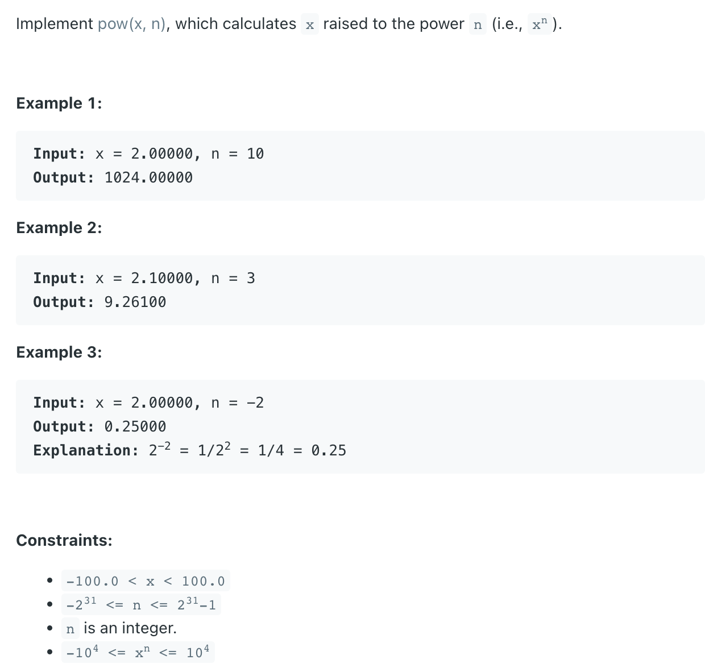

## 50. Pow(x, n)

---
```java
class Pow {
    public double myPow(double x, int n) {
        if (n < 0) {
            return 1.0 / recursion(x, -n);
        }

        return recursion(x, n);
    }

    private double recursion(double x, int n) {
        if (n == 0) {
            return 1.0;
        }

        double half = recursion(x, n / 2);
        if (n % 2 == 0) {
            return half * half;
        } else {
            return half * half * x;
        }
    }
}
```


---
### Brute Force
```java
class Pow_BruteForce {
    public double myPow(double x, int n) {
        if (n == 0) {
            return 1.0;
        }
        if (n < 0) {
            return 1.0 / myPow(x, -n);
        }

        return x * myPow(x, n - 1);
    }

    public static void main(String[] args) {
        Pow_BruteForce pow_bruteForce = new Pow_BruteForce();
        double res = pow_bruteForce.myPow(2.1, 3);
        System.out.println(res); // 9.2610

        res = pow_bruteForce.myPow(2.0, -2);
        System.out.println(res); // 0.25
    }
}
```
