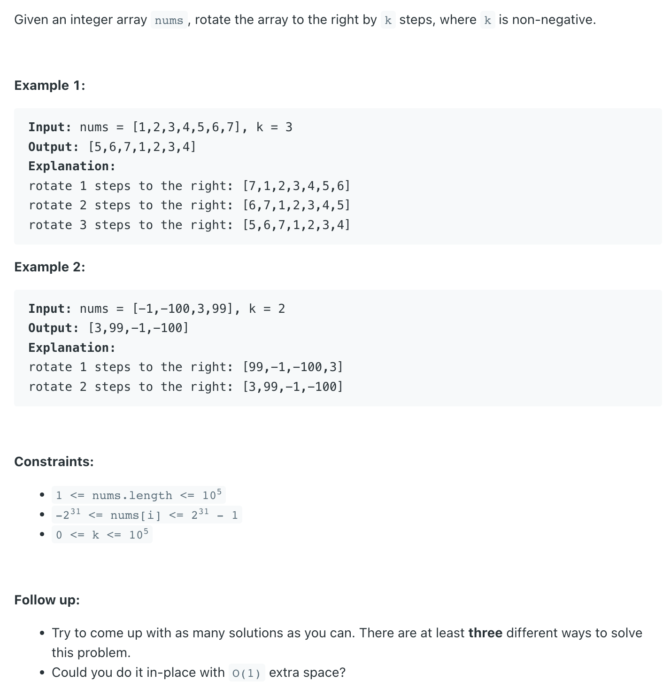

## 189. Rotate Array


---
```ruby
Follow up:

Try to come up with as many solutions as you can. 
There are at least three different ways to solve this problem.
Could you do it in-place with O(1) extra space?


nums = "----->-->"; k =3
result = "-->----->";

reverse "----->-->" we can get "<--<-----"
reverse "<--" we can get "--><-----"
reverse "<-----" we can get "-->----->"
```
---
```java
class Solution {
    public void rotate(int[] nums, int k) {
        if (k == 0) {
            return;
        }
        int len = nums.length;
        k %= len;
        reverse(nums, 0, len-1);
        reverse(nums, 0, k-1);
        reverse(nums, k, len-1);
    }
    
    private void reverse(int[] arr, int left, int right) {
        while(left < right){
            int temp = arr[left];
            arr[left] = arr[right];
            arr[right] = temp;
            left++;
            right--;
        }
    }
}
```
---

### similar: 186. Reverse Words in a String II